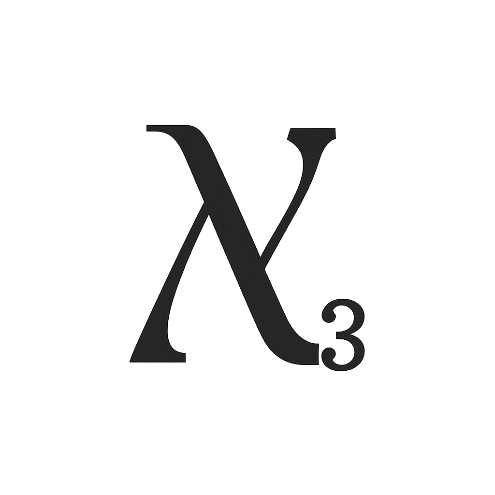

<p align="center">
  
</p>

# Aleph3
Aleph3 is transitioning from a broad CAS prototype toward a smaller,
embeddable formula engine for native applications. The legacy parser/evaluator
still exist in this repository, but the current product direction is SDK-first:
stable public types, a narrow trusted-subset IR, structured diagnostics, and
host-controlled evaluation.

## Current Repository Tracks
- Legacy prototype engine: broad parser/evaluator behavior used as reference material
- Rewrite path: public SDK under `include/sdk/` and trusted-subset IR under `include/ir/`
- Aleph3 CLI: `aleph3_cli` for manual lexer/parser/SDK checks
- SDK validation and compile path: `validate` is live with schema/arity/type checks and `compile` now creates reusable formula handles
- SDK runtime path: `evaluate` now runs the trusted-subset tree interpreter
- Host function contract: engine-scoped registration now enforces callback metadata at registration and runtime
- Host-function tooling: `evaluate-host` and `aleph3_sdk_example` exercise embedded callbacks end-to-end
- SDK docs index: [docs/sdk/README.md](docs/sdk/README.md)

## Getting Started
To build Aleph3, ensure you have CMake 3.20+ and a C++20-compatible compiler installed. Follow these steps:
1. Clone the repository:
   ```bash
   git clone https://github.com/sergiorf/aleph3.git
   cd aleph3
   ```

2. Build the SDK and primary engine only:
   ```bash
   cmake -S . -B build -DALEPH3_BUILD_LEGACY=OFF -DBUILD_TESTING=OFF
   cmake --build build
   ```

   Run the CLI:
   ```bash
   ./build/bin/aleph3_cli
   ./build/bin/aleph3_cli help
   ./build/bin/aleph3_cli examples
   ./build/bin/aleph3_cli host-functions
   ./build/bin/aleph3_cli tokens "If[x >= 1, \"ok\", False]"
   ./build/bin/aleph3_cli parse "2 + 3 * (x + 1)"
   ./build/bin/aleph3_cli validate "1 + 2"
   ./build/bin/aleph3_cli validate "If[True, 1, \"no\"]"
   ./build/bin/aleph3_cli compile "1 + 2"
   ./build/bin/aleph3_cli evaluate --var x=3 "x + 1"
   ./build/bin/aleph3_cli evaluate --var label=hello "label + 1"
   ./build/bin/aleph3_cli evaluate "If[3 < 4, 10, 20]"
   ./build/bin/aleph3_cli evaluate-host --var x=12 "Clamp[x, 0, 10]"
   ./build/bin/aleph3_cli evaluate-host --var x=4 "ScaleAdd[x, 1.5, 2]"
   ./build/bin/aleph3_cli evaluate-host --var flag=True "PickLabel[flag, \"ok\", \"fail\"]"
   ./build/bin/aleph3_sdk_example
   ./build/bin/aleph3_cli repl
   ```

   Running `./build/bin/aleph3_cli` with no arguments starts the interactive REPL.
   `validate`, `compile`, trusted-subset `evaluate`, and demo host-function checks are now live on the primary SDK path.

3. Build the legacy CLI and tests when you need the prototype path:
   ```bash
   cmake -S . -B build
   cmake --build build
   cd build
   ctest --output-on-failure --verbose
   ```

## Documentation
- SDK overview: [docs/sdk/README.md](docs/sdk/README.md)
- Delivery plan: [docs/embedded_formula_engine_implementation_plan.md](docs/embedded_formula_engine_implementation_plan.md)
- System architecture: [docs/system_architecture.md](docs/system_architecture.md)
- Trusted subset scope: [docs/trusted_subset_v1.md](docs/trusted_subset_v1.md)

## License
[MIT License](LICENSE)
