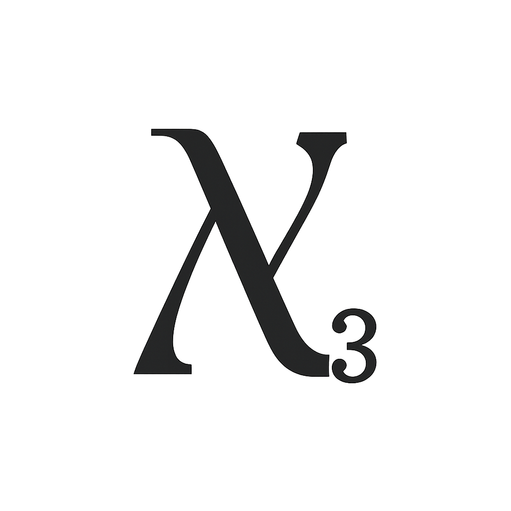

<p align="center">
  
</p>

# Aleph3
Aleph3 is a safe embeddable formula and symbolic engine in C++20, with a path
toward richer CAS features.

Today, the strongest product surface is the SDK and its trusted embedded
formula subset. The broader symbolic kernel is real and growing, but it is not
yet positioned as near-parity with Mathematica-class systems.

The architecture is:

- `aleph3_kernel`: the explicit kernel build target for the current symbolic
  engine surface
- `aleph3_symbolic`: a compatibility alias during migration
- `aleph3_sdk`: the host-facing embedding layer built on top of that core
- future products: additional tooling and services that reuse the same
  symbolic semantics

Current architecture warning:

- `src/evaluator` is the symbolic engine path
- the active refactor direction is convergence on one kernel plus pack-style
  domain growth
- the SDK now builds on and evaluates through the kernel directly even when
  the broader symbolic surface is disabled

## What Aleph3 Is Today

Aleph3 currently serves two closely related use cases:

- embedded formula execution through the SDK
- kernel-backed symbolic evaluation for a documented supported subset

Practical examples:

- embed `If[temp > limit, "alarm", "ok"]` in a host application
- evaluate `Clamp[x, 0, 10]` through an application-provided function
- perform bounded symbolic transforms such as `Expand[(1/2) * (x + 1)]`

Aleph3 should currently be read as:

- an embeddable formula engine with symbolic capabilities
- a kernel-first system growing toward richer CAS features

Aleph3 should not currently be read as:

- a full Mathematica-like CAS

## Syntax

Aleph3 currently accepts a Wolfram-like expression syntax for its symbolic and
CLI-facing workflows.

Examples:

- `If[x >= 1, "ok", False]`
- `Clamp[x, 0, 10]`
- `Replace[f[x], f[a_] -> g[a]]`

That syntax is a current frontend, not the whole product identity.
The long-term kernel design keeps syntax separate from semantics so Aleph3 can
support compatibility syntax, a more Aleph3-native syntax, or both over time.

## Current Repository Tracks
- Symbolic kernel and early math surface: parser, evaluator, transforms, and
  current algebra utilities
- SDK layer: public API under `include/sdk/` and trusted-subset IR under `include/ir/`
- Surviving host-facing SDK contract: `Engine`, `Schema`, `Policy`, `Types`, and opaque compiled formulas under `include/sdk/`
- CLI surface: `aleph3_cli` for symbolic and SDK checks
- SDK validation and compile path: `validate` performs schema/arity/type checks and `compile` creates reusable formula handles
- SDK execution path: `evaluate` lowers trusted-subset formulas into kernel
  expressions and executes them through the shared kernel path
- Host function contract: engine-scoped registration enforces callback metadata at registration and runtime
- Host-function tooling: `evaluate-host` and `aleph3_sdk_example` exercise embedded callbacks end-to-end
- Docs index: [docs/README.md](docs/README.md)

## Getting Started
To build Aleph3, ensure you have CMake 3.20+ and a C++20-compatible compiler installed.
1. Clone the repository:
   ```bash
   git clone https://github.com/sergiorf/aleph3.git
   cd aleph3
   ```

2. Build the default developer targets:
   ```bash
   cmake -S . -B build
   cmake --build build
   ```

   Start the CLI once, then try commands inside the REPL:
   ```bash
   ./build/bin/aleph3_cli repl
   ```

   Inside the REPL:
   ```text
   > :help
   > :examples
   > :host-functions
   > :tokens If[x >= 1, "ok", False]
   > :parse 2 + 3 * (x + 1)
   > :validate 1 + 2
   > :validate If[True, 1, "no"]
   > :compile 1 + 2
   > :evaluate --var x=3 x + 1
   > :evaluate --var label=hello label + 1
   > :evaluate If[3 < 4, 10, 20]
   > :evaluate-host --var x=12 Clamp[x, 0, 10]
   > :evaluate-host --var x=4 ScaleAdd[x, 1.5, 2]
   > :evaluate-host --var flag=True PickLabel[flag, "ok", "fail"]
   > :quit
   ```

   Running `./build/bin/aleph3_cli` with no arguments also starts the interactive REPL.
   Use direct one-shot commands only when you want shell-friendly scripting, for example:
   ```bash
   ./build/bin/aleph3_cli help
   ./build/bin/aleph3_cli examples
   ./build/bin/aleph3_cli host-functions
   ./build/bin/aleph3_sdk_example
   ```

   `validate`, `compile`, trusted-subset `evaluate`, and demo host-function checks are all available from the primary SDK-backed CLI path.

   A few practical REPL examples:
   ```text
   > :evaluate If[3 < 4, "alarm", "ok"]
   > :evaluate-host --var x=12 Clamp[x, 0, 10]
   > :symbolic-evaluate Replace[f[x], f[a_] -> g[a]]
   > :symbolic-evaluate Refine[Sqrt[x^2], x <= 0]
   ```

3. Build a smaller SDK-only configuration when needed:
   ```bash
   cmake -S . -B build-sdk -DALEPH3_BUILD_SYMBOLIC_ENGINE=OFF -DBUILD_TESTING=OFF
   cmake --build build-sdk
   ```

   In this configuration, the SDK still builds its kernel dependency.
   `ALEPH3_BUILD_SYMBOLIC_ENGINE=OFF` disables the broader symbolic surface and
   related tests; it does not remove the kernel from the SDK build graph.

4. Run tests:
   ```bash
   ctest --test-dir build --output-on-failure --verbose
   ```

## Documentation

Start at the [documentation index](docs/README.md). The main reading path is:

1. [Architecture](docs/architecture.md)
2. [Concepts and terminology](docs/concepts.md)
3. [SDK guide](docs/sdk/README.md) or the focused kernel specifications
4. [Unified implementation plan](docs/aleph3_unified_plan.md)

The index separates explanatory guides, normative contracts, and planning so
there is one obvious home for each kind of information.

## License
[MIT License](LICENSE)
