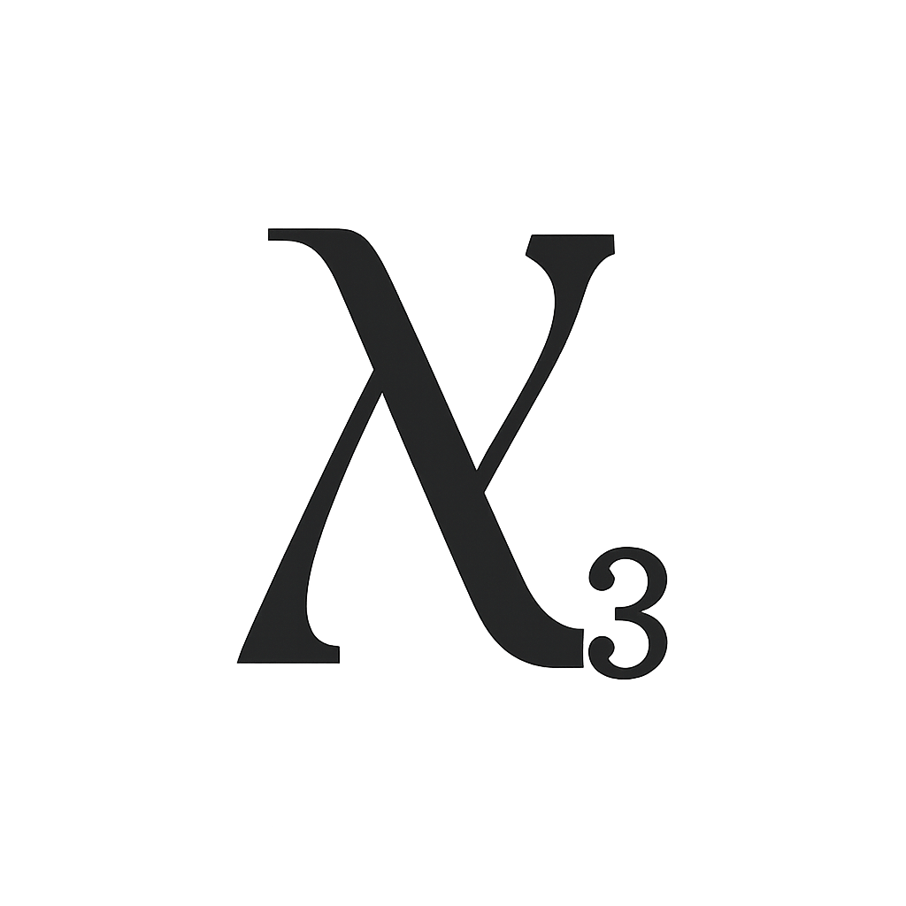

<p align="center">
  
</p>

# Mathix
_A computational software system written in C++._

## Mathix: A C++ Computer Algebra System

Mathix is a powerful and flexible computer algebra system written in modern C++ (C++20). It allows users to perform symbolic computations, evaluate mathematical expressions, and define custom functions.

## Features
- Basic algebraic operations: `+`, `-`, `*`, `/`
- Symbolic computation support
- Extensible architecture for advanced features

## Getting Started
To build Mathix, ensure you have CMake 3.20+ and a C++20-compatible compiler installed. Follow these steps:
1. Clone the repository:
   ```bash
   git clone https://github.com/sergiorf/mathix.git
   cd mathix
   ```

2. Build the project:
   ```bash
   cmake -S . -B build
   cmake --build build
   ```

3. Run the Mathix CLI:
   ```bash
   ./build/bin/mathix
   ```

## Contributing
If you want to contribute to Mathix, please contact me via email or open an issue in the GitHub repository. Contributions are welcome!

### C++ Style Guide
To ensure consistency and readability across the codebase, please follow the [C++ Style Guide](docs/style_guide.md). It includes naming conventions, formatting rules, and best practices for contributing to Mathix.

## License
[MIT License](LICENSE)