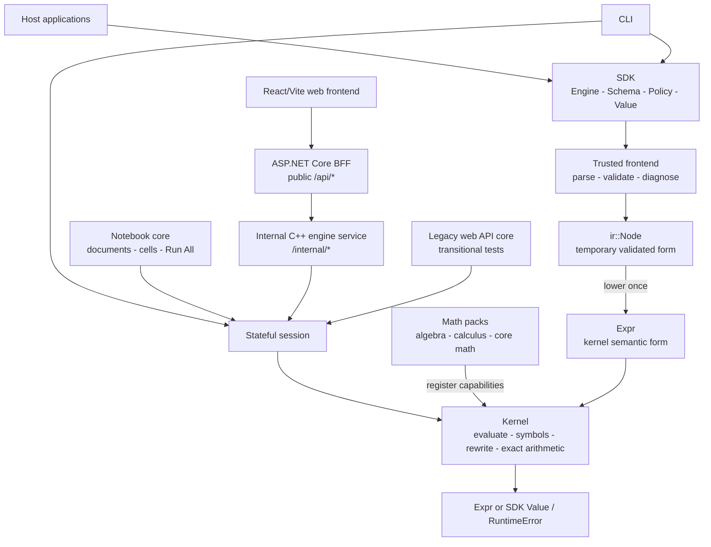
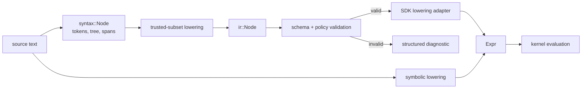
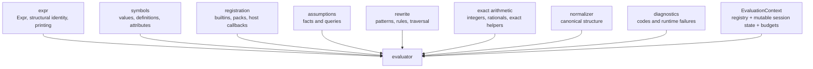
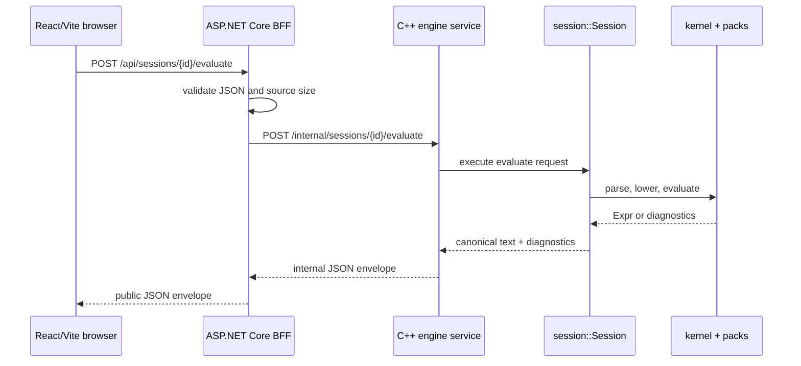
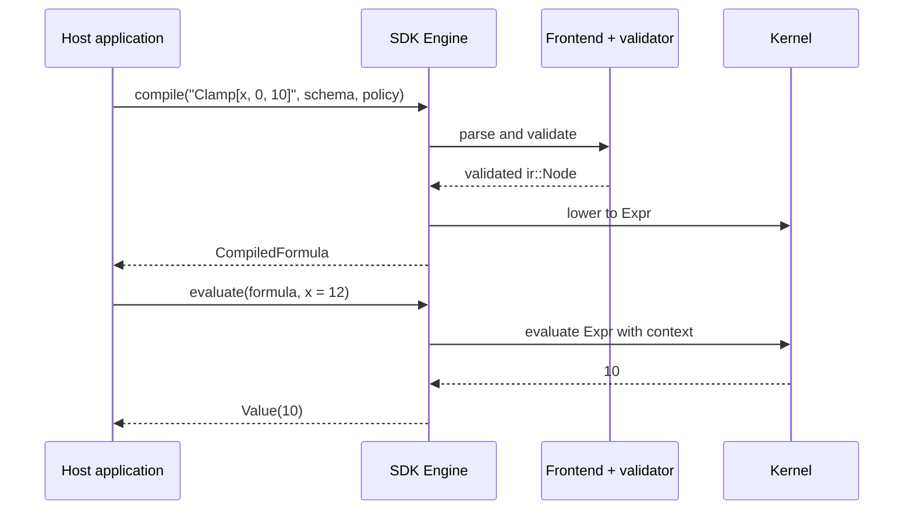
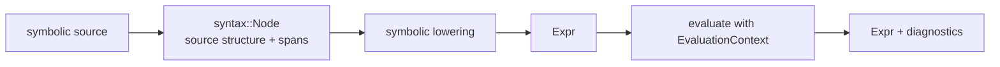
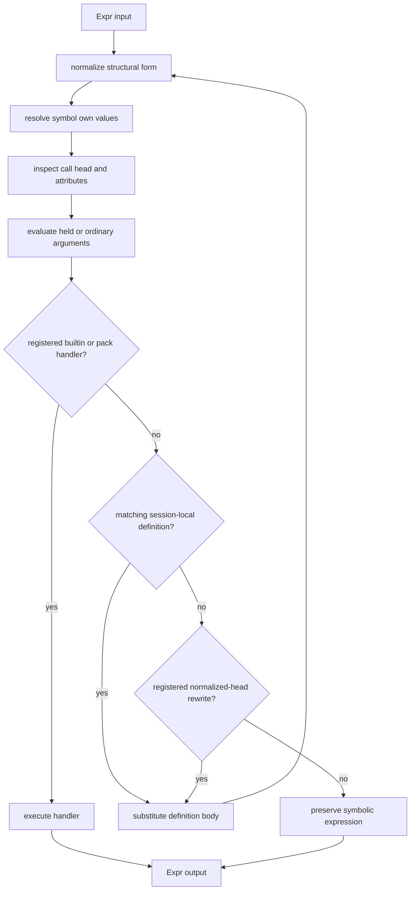
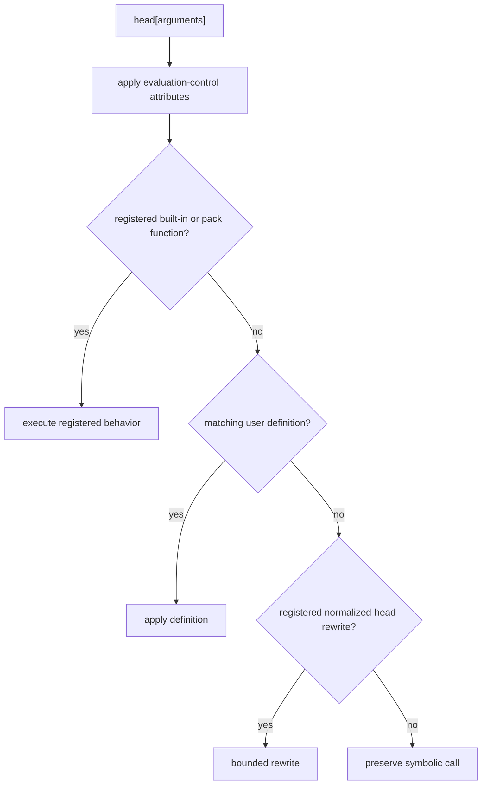
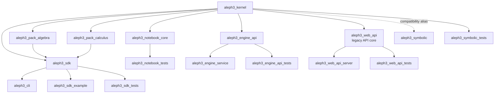
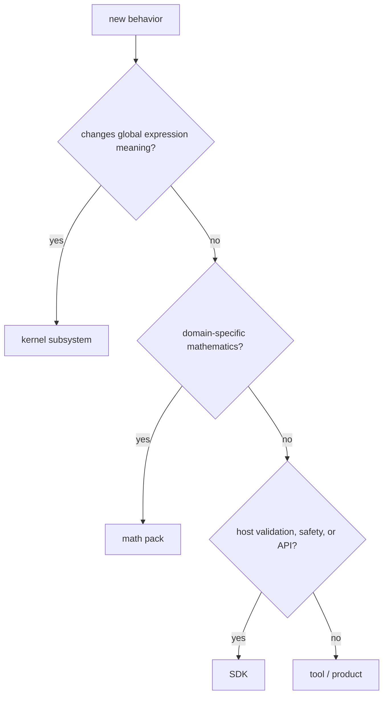

# Aleph3 Architecture

## Purpose

This is the architectural source of truth for Aleph3. It explains the system
shape, ownership boundaries, execution paths, and dependency rules. Detailed
behavior belongs in the focused kernel and SDK specifications linked from the
[documentation index](README.md).

Aleph3 is a symbolic engine moving toward a lightweight, local-first notebook
product. The shared kernel is the product-critical semantic asset. The CLI,
SDK, stateful session layer, headless notebook core, internal engine service,
and first web evaluator slice are current consumers of that same kernel.

## System At A Glance



The implementation shares one source-aware syntax layer beneath the SDK
trusted frontend and the symbolic session path. `syntax::Node` records parsed
source structure and spans; SDK lowering turns the trusted subset into
`ir::Node`, while symbolic lowering turns the supported symbolic surface into
`Expr`.

Four layers remain stable even as directories move:

1. **Kernel** - defines what expressions mean.
2. **Packs** - add domain mathematics through kernel contracts.
3. **SDK** - validates, constrains, and exposes the kernel to host programs.
4. **Tools and products** - the CLI, notebook core, web surfaces, and other
   consumers present shared session and kernel behavior without inventing
   semantics.

Dependencies point downward. A lower layer must not depend on host-facing
policy or a particular product.

## Representation

Aleph3 has one semantic representation: `Expr`.

`syntax::Node` is the shared parsed-source form. It is deliberately syntactic:
it carries source structure and diagnostics context, but it does not define
expression meaning.

The SDK also uses `ir::Node`, but only while parsing and validating the trusted
formula subset. Once a formula is valid, a one-way adapter lowers it into
`Expr`. `ir::Node` is therefore a frontend artifact, not a second AST with a
second evaluator.



Example: SDK input `x - 2` may first be represented by a subtraction node with
a source span. Lowering produces the kernel shape `Plus[x, Times[-1, 2]]`.
The source span helps the SDK report errors; the normalized heads tell the
kernel what the expression means.

## Expression Identity

Kernel expressions are persistent immutable values. `ExprPtr` is a shared
pointer to a const `Expr`, and transformations inspect existing trees before
constructing new expression nodes. Reusing an unchanged child pointer is a
value-sharing optimization, not an opportunity to mutate shared state.

Structural identity is owned by the expression layer. `structural_equal`
compares expression shape and stored values; it is not mathematical
equivalence. For example, `x + x` and `2*x` are structurally different unless
normalization or simplification has already produced the same representation.

`structural_hash` follows the same tree shape and value contract as structural
equality. The required invariant is:

```text
structural_equal(a, b) => structural_hash(a) == structural_hash(b)
```

The hash is not a uniqueness guarantee, and callers must still use structural
equality when collisions matter. `structural_less` and `ExprStructuralLess`
provide deterministic structure-based ordering for canonicalization and
ordered containers. This ordering is independent of rendering and is not
mathematical `<`.

Printing is presentation. `to_string` and `to_string_raw` may be used for
display, diagnostics, logs, and explicit serialization surfaces, but semantic
identity, deduplication, canonical ordering, and equality decisions must use
the expression-owned structural APIs instead.

The immutable expression contract is compatible with future hash-consing,
interning, cached hashes, and DAG sharing, but Aleph3 does not currently
maintain a global expression intern table or require pointer identity for
semantic equality.

## Kernel Architecture

The kernel owns behavior that affects symbolic meaning globally:

- `Expr` construction and structural identity.
- Evaluation order and symbolic fallback.
- Symbol metadata, own values, function definitions, and attributes.
- Normalization, bounded simplification, and rewrite execution.
- Exact scalar arithmetic and assumption queries.
- Diagnostics, budgets, and registration contracts.

The evaluator orchestrates these subsystems. It must not become a collection
of unrelated domain algorithms.



`EvaluationContext` is the mutable execution environment for one SDK engine or
interactive session. It carries the function registry, session-local symbol
values, user function definitions, active assumptions, and request budget
counters. Sharing the context across requests is what makes assignments persist
in a REPL session; constructing a fresh context is what makes notebook `Run
All` deterministic.

## Packs

Packs own domain algorithms over stable kernel primitives: algebra, calculus,
solvers, linear algebra, and special functions. A pack registers functions,
metadata, or rules; it does not reach around the kernel to create a private
evaluation path.

For example, matching a pattern and applying a rule is kernel infrastructure.
Knowing that `D[x^2, x]` becomes `2 * x` belongs in the `core-calculus` pack.
Knowing how to factor the supported exact polynomial subset belongs in the
`core-algebra` pack.

## SDK

The SDK owns the public embedding contract:

- `Engine`, `Schema`, `Policy`, `Types`, and opaque compiled formulas.
- Trusted-subset parsing and validation.
- Source-oriented diagnostics.
- Allowlists, complexity limits, and evaluation budgets.
- Conversion between host values and kernel values.
- Engine-scoped host functions.

The SDK constrains kernel behavior; it does not redefine arithmetic or
symbolic semantics.

## Tools And Products

The CLI, web surfaces, examples, tests, and notebook products are consumers.
They may compose APIs and present results, but semantic rules do not belong
there.

The stateful session layer is the reusable interactive consumer boundary. It
owns one kernel evaluation context across requests, returns rendered results
plus structured diagnostics, and is used by the symbolic CLI REPL, the
internal web engine service, and the transitional web API core. Notebook and
IDE consumers build on this boundary rather than owning evaluator state
themselves.

The Web MVP public backend is the ASP.NET Core BFF. Browser traffic reaches
only `/api/*` on the BFF, which validates product-facing requests and delegates
computation to the internal C++ engine service. The engine service owns
session lifecycle and symbolic evaluation over `/internal/*`; it does not own
browser cookies, notebook ownership, Postgres product persistence, examples,
or future account policy.



## Notebook

The current `aleph3_notebook_core` library owns the GUI-independent document
model: ordered input and text cells, generated result records, v1 JSON
persistence, cached-result clearing, and clean `Run All` over a fresh session.
It is not a full graphical notebook application. The future GUI owns editing,
presentation, file interaction, and example browsing over this core.

Notebook code sends typed requests to a session and receives structured
results and diagnostics. It must not parse expressions into a private semantic
form, evaluate formulas, or implement pack behavior.

Notebook files store source and presentation data; persisted rendered output
is a cache, never semantic authority. Reopening a document does not recreate
kernel state from hidden process memory. `Run All` reconstructs state by
replaying input cells from a clean session in document order.

## Repository Ownership

| Area | Owner | Role |
| --- | --- | --- |
| `include/expr`, `src/expr` | kernel | symbolic representation |
| `include/evaluator`, `src/evaluator` | kernel | evaluation orchestration |
| `include/kernel`, `src/kernel` | kernel | shared contracts and SDK bridge |
| `include/symbols`, `include/normalizer` | kernel | definitions and canonical form |
| `include/transforms`, `src/transforms` | kernel or pack | structural transforms stay in kernel; domain transforms move to packs |
| `include/algebra`, `src/algebra` | algebra pack | domain-specific exact algebra |
| `include/packs`, `src/packs` | kernel contracts / pack bootstrap | registration boundary for algebra and calculus packs |
| `include/syntax`, `src/syntax` | shared frontend | Wolfram-like lexing, parsing, source spans, and explicit lowering entrypoints |
| `include/frontend`, `src/frontend` | SDK | trusted-subset compatibility facade and diagnostics |
| `include/ir` | SDK | validated transient representation |
| `include/semantics`, `src/semantics` | SDK | schema and policy validation |
| `include/sdk`, `src/sdk` | SDK | public host API |
| `include/tooling`, `src/tooling` | tooling | CLI and supporting presentation |
| `include/notebook`, `src/notebook` | notebook core | document model, JSON persistence, cached results, clean `Run All` |
| `include/web`, `src/web` | web computation/product transition | internal engine API over shared sessions plus transitional transport-independent web API core |
| `web/bff` | product backend | ASP.NET Core public `/api/*` boundary, request validation, engine error mapping, and future product persistence |
| `web/frontend` | product frontend | React/Vite editing and presentation surface that delegates execution to the BFF |
| future graphical notebook application | product | cells, display, local file workflows, example gallery, export |

When ownership is unclear, ask: "Would changing this change expression meaning
for every consumer?" If yes, it is probably kernel work. If it is a domain
algorithm, it is pack work. If it controls what a host is allowed to submit,
it is SDK work.

## Execution Paths

### SDK Formula



Compilation proves that syntax, variables, calls, and policy are acceptable.
Evaluation supplies runtime values and executes the already-lowered kernel
expression.

### Symbolic Expression



Symbolic lowering constructs `Expr` forms such as `Rule`, `Assignment`, exact
rationals, and function definitions. Those compatibility conveniences are not
SDK trusted semantics unless trusted-subset lowering and validation accept them
explicitly. The legacy `parse_expression` helper is a compatibility wrapper
over this shared symbolic path.

Evaluation, normalization, and rewriting are related but distinct. Evaluation
resolves meanings such as numeric addition or definitions. Normalization gives
equivalent structures a stable shape. Rewriting applies explicit structural
rules. Keeping them distinct makes scheduling and budgets visible.

### Kernel Evaluation Pipeline



This is a conceptual pipeline, not a promise that every implementation step is
a separate function call. The important contract is ownership: evaluation
decisions use kernel state and registered pack behavior, while sessions,
the SDK, notebooks, and web code only choose which request to submit and how
to display the result.

Example:

```text
input source:  D[x^2 + 3*x, x]
syntax form:   call named D with two arguments
kernel Expr:   D[Plus[Power[x, 2], Times[3, x]], x]
registry:      core-calculus owns D
output Expr:   Plus[Times[2, x], 3]
display text:  2 * x + 3
```

## Symbol Resolution And Extension

At a high level, a function call moves through registered and user-visible
behavior in a defined order:



This diagram is an orientation, not a substitute for the normative
[symbol precedence](kernel_symbol_definition_precedence.md),
[symbol model](kernel_symbol_model_spec.md), and
[rewrite](kernel_rewrite_spec.md) specifications.

## Build Graph



`aleph3_symbolic` is a compatibility alias, not another engine. Disabling the
broader symbolic product surface does not remove the kernel dependency from
the SDK.

## Architectural Invariants

- There is one kernel and one source of semantic truth.
- `Expr` is the kernel form; `syntax::Node` and `ir::Node` are frontend forms.
- Lowering is one-way and contains translation, not new semantics.
- Domain mathematics grows through packs over kernel contracts.
- Evaluation budgets and diagnostics cross layers explicitly.
- Public SDK types do not expose internal expression or IR implementation.
- Tools and products never become semantic centers.
- The kernel never depends on the session, notebook, web, or a GUI toolkit.
- Notebook documents and render trees are product data, not kernel expression
  representations.
- Transitional aliases or adapters must be labeled and prevented from growing
  into permanent parallel systems.

## Adding A Feature

Use this path before choosing a directory:



For current implementation sequencing, see the
[Web MVP Launch Plan](web_mvp_launch_plan.md) and the longer-term
[Unified Plan](aleph3_unified_plan.md). For vocabulary and worked examples,
see [Concepts and Terminology](manual/concepts-and-terminology.md). The
notebook product contract and shipped headless slices are in the
[Notebook MVP Design](notebook_mvp_design.md).
