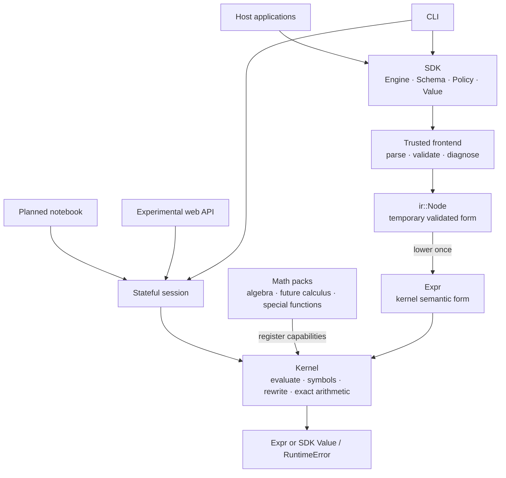
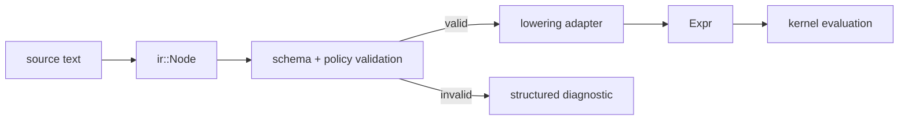
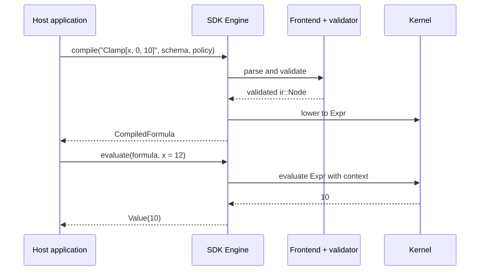
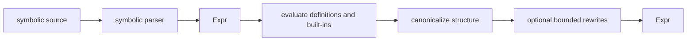
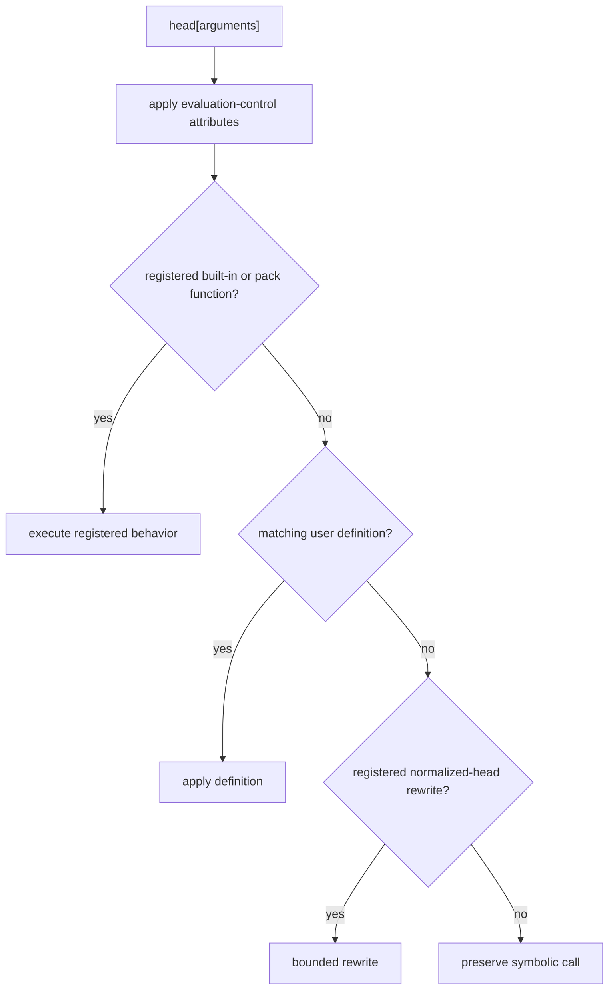
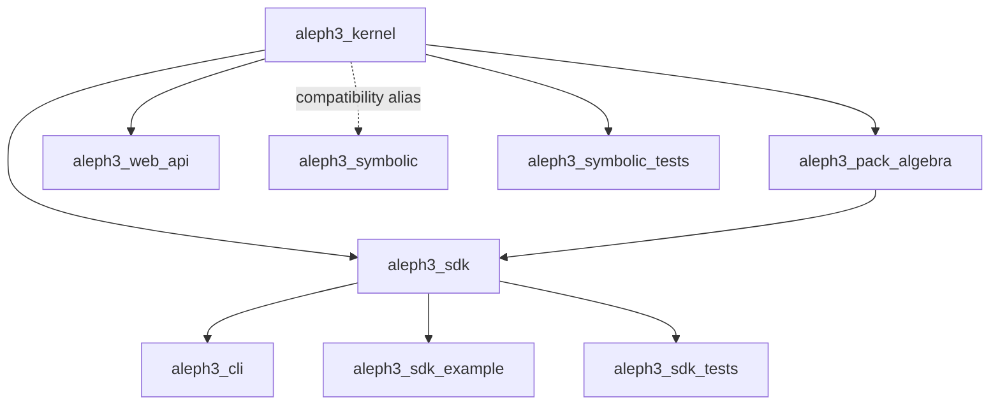
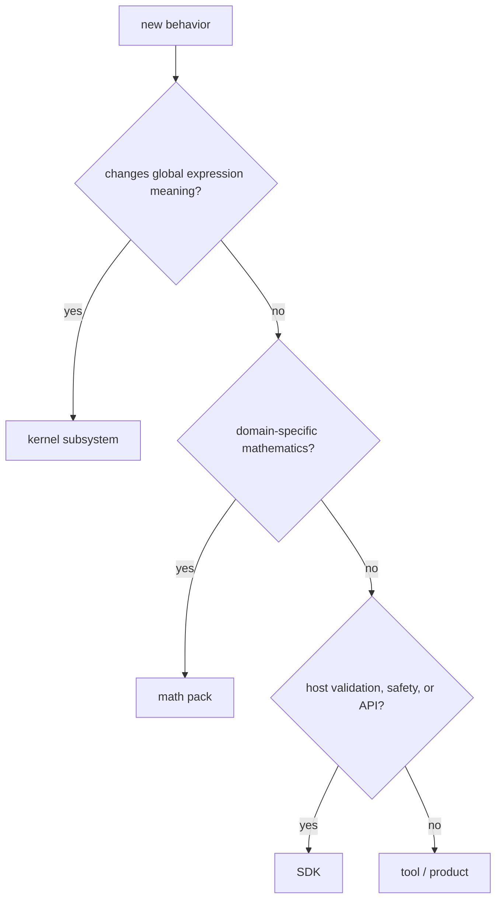

# Aleph3 Architecture

## Purpose

This is the architectural source of truth for Aleph3. It explains the system
shape, ownership boundaries, execution paths, and dependency rules. Detailed
behavior belongs in the focused kernel and SDK specifications linked from the
[documentation index](README.md).

Aleph3 is becoming a lightweight, local-first symbolic notebook. The notebook
is the intended main product; the SDK and CLI are current consumers of the
shared symbolic kernel, which remains the product-critical semantic asset.

## System at a Glance



The implementation now shares one source-aware syntax layer beneath the SDK
trusted frontend and the symbolic session path. `syntax::Node` records parsed
source structure and spans; SDK lowering turns the trusted subset into
`ir::Node`, while symbolic lowering turns the supported symbolic surface into
`Expr`.

Four layers remain stable even as directories move:

1. **Kernel** — defines what expressions mean.
2. **Packs** — add domain mathematics through kernel contracts.
3. **SDK** — validates, constrains, and exposes the kernel to host programs.
4. **Tools and products** — the CLI, planned notebook, and other consumers
   present shared session and kernel behavior without inventing semantics.

Dependencies point downward. A lower layer must not depend on host-facing
policy or a particular product.

## The Central Representation Decision

Aleph3 has one semantic representation: `Expr`.

`syntax::Node` is the shared parsed-source form. It is deliberately syntactic:
it carries source structure and diagnostics context, but it does not define
expression meaning.

The SDK also uses `ir::Node`, but only while parsing and validating the trusted
formula subset. Once a formula is valid, a one-way adapter lowers it into
`Expr`. `ir::Node` is therefore a frontend artifact, not a second AST with a
second evaluator.



Example: SDK input `x - 2` may first be represented by a subtraction node with
a source span. Lowering produces the kernel shape `Plus[x, Times[-1, 2]]`.
The source span helps the SDK report errors; the normalized heads tell the
kernel what the expression means.

## Layer Responsibilities

### Kernel

The kernel owns behavior that affects symbolic meaning globally:

- `Expr` construction and structural identity
- evaluation order and symbolic fallback
- symbol metadata, values, definitions, and attributes
- normalization and bounded rewrite execution
- exact scalar arithmetic and assumptions
- diagnostics, budgets, and registration contracts

The evaluator orchestrates these subsystems. It must not become a collection
of unrelated domain algorithms.

### Packs

Packs own domain algorithms over stable kernel primitives: algebra,
calculus, solvers, linear algebra, and special functions. A pack registers
functions, metadata, or rules; it does not reach around the kernel to create a
private evaluation path.

For example, matching a pattern and applying a rule is kernel infrastructure.
Knowing that `D[x^2, x]` becomes `2*x` belongs in a calculus pack.

### SDK

The SDK owns the public embedding contract:

- `Engine`, `Schema`, `Policy`, `Types`, and opaque compiled formulas
- trusted-subset parsing and validation
- source-oriented diagnostics
- allowlists, complexity limits, and evaluation budgets
- conversion between host values and kernel values
- engine-scoped host functions

The SDK constrains kernel behavior; it does not redefine arithmetic or
symbolic semantics.

### Tools and Products

The CLI, web API, examples, tests, and future applications are consumers. They
may compose APIs and present results, but semantic rules do not belong there.

The experimental stateful session layer is the first reusable interactive
consumer boundary. It owns one kernel evaluation context across requests,
returns rendered results plus structured diagnostics, and is used by the
symbolic CLI REPL and the experimental web API core. The planned notebook and
any later IDE consumers should build on this boundary rather than owning
evaluator state themselves.

### Notebook

The planned `aleph3_notebook` application owns cell ordering, text/Markdown
cells, output presentation, document persistence, examples, and later export.
It sends typed requests to a session and receives structured results and
diagnostics. It must not parse expressions into a private semantic form,
evaluate formulas, or implement pack behavior.

The initial boundary should support these conceptual operations without
promising that their final C++ spelling is settled:

```text
parse(source) -> Expression or diagnostic
evaluate(expression, context) -> EvaluationResult
format(result, displayOptions) -> DisplayNode or text
serializeNotebook(document) -> versioned bytes
loadNotebook(bytes) -> document or diagnostic
```

Parsing, evaluation, formatting, and notebook persistence remain separate.
Notebook files store source and presentation data; persisted rendered output
is a cache, never semantic authority.

## Repository Ownership

| Area | Owner | Role |
| --- | --- | --- |
| `include/expr`, `src/expr` | kernel | symbolic representation |
| `include/evaluator`, `src/evaluator` | kernel | evaluation orchestration |
| `include/kernel`, `src/kernel` | kernel | shared contracts and SDK bridge |
| `include/symbols`, `include/normalizer` | kernel | definitions and canonical form |
| `include/transforms`, `src/transforms` | kernel or pack | structural transforms stay in kernel; domain transforms move to packs |
| `include/algebra`, `src/algebra` | algebra pack | domain-specific exact algebra |
| `include/packs`, `src/packs` | kernel contracts / pack bootstrap | registration boundary |
| `include/syntax`, `src/syntax` | shared frontend | Wolfram-like lexing, parsing, source spans, and explicit lowering entrypoints |
| `include/frontend`, `src/frontend` | SDK | trusted-subset compatibility facade and diagnostics |
| `include/ir` | SDK | validated transient representation |
| `include/semantics`, `src/semantics` | SDK | schema and policy validation |
| `include/sdk`, `src/sdk` | SDK | public host API |
| `include/tooling`, `src/tooling` | tooling | CLI and supporting presentation |
| `include/web`, `src/web` | product API | experimental transport-independent web API core over anonymous clients and shared sessions |
| future notebook application | product | cells, documents, display, persistence, export |

When ownership is unclear, ask: “Would changing this change expression meaning
for every consumer?” If yes, it is probably kernel work. If it is a domain
algorithm, it is pack work. If it controls what a host is allowed to submit,
it is SDK work.

## Execution Paths

### SDK Formula



Compilation proves that syntax, variables, calls, and policy are acceptable.
Evaluation supplies runtime values and executes the already-lowered kernel
expression.

### Symbolic Expression



The parser stage above is shared syntax parsing. Symbolic lowering is the step
that constructs `Expr` forms such as `Rule`, `Assignment`, exact rationals, and
function definitions. Those compatibility conveniences are not SDK trusted
semantics unless trusted-subset lowering and validation accept them explicitly.
The legacy `parse_expression` helper is a compatibility wrapper over this
shared symbolic path.

Evaluation, normalization, and rewriting are related but distinct. Evaluation
resolves meanings such as numeric addition or definitions. Normalization gives
equivalent structures a stable shape. Rewriting applies explicit structural
rules. Keeping them distinct makes scheduling and budgets visible.

## Symbol Resolution and Extension

At a high level, a function call moves through registered and user-visible
behavior in a defined order:



This diagram is an orientation, not a substitute for the normative
[symbol precedence](kernel_symbol_definition_precedence.md),
[symbol model](kernel_symbol_model_spec.md), and
[rewrite](kernel_rewrite_spec.md) specifications.

## Build Graph



`aleph3_symbolic` is a compatibility alias, not another engine. Disabling the
broader symbolic product surface does not remove the kernel dependency from
the SDK.

## Architectural Invariants

- There is one kernel and one source of semantic truth.
- `Expr` is the kernel form; `ir::Node` is an SDK frontend form.
- Lowering is one-way and contains translation, not new semantics.
- Domain mathematics grows through packs over kernel contracts.
- Evaluation budgets and diagnostics cross layers explicitly.
- Public SDK types do not expose internal expression or IR implementation.
- Tools and products never become semantic centers.
- The kernel never depends on the session, notebook, or a GUI toolkit.
- Notebook documents and render trees are product data, not kernel expression
  representations.
- Transitional aliases or adapters must be labeled and prevented from growing
  into permanent parallel systems.

## Adding a Feature

Use this path before choosing a directory:



For current implementation sequencing, see the
[unified plan](aleph3_unified_plan.md). For vocabulary and worked examples,
see [Concepts and Terminology](manual/concepts-and-terminology.md). The proposed first product
contract is in the [Notebook MVP Design](notebook_mvp_design.md).
