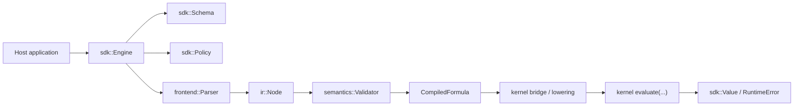
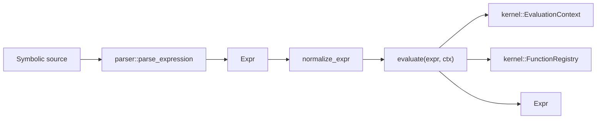

# Class Collaboration

## Purpose

This document explains how the main Aleph3 classes and subsystems currently
work together.

It is not a replacement for the architecture docs.
It is the collaboration view across the current refactor state.

Related documents:

- [Architecture](architecture.md)
- [System Architecture](system_architecture.md)
- [SDK Stable Interfaces](sdk/stable_interfaces.md)
- [Symbolic Core Architecture](symbolic_core_architecture.md)
- [Kernel Symbol Definition Precedence](kernel_symbol_definition_precedence.md)
- [Kernel Representation Decision](kernel_representation_decision.md)

## Two Active Collaboration Tracks

Aleph3 currently has two interacting tracks in the repository:

1. SDK / trusted-subset track
2. symbolic kernel track

They are converging, but they are not fully unified yet.

## SDK Track

The SDK track is the host-facing path used for bounded embedded evaluation.

Main classes:

- `Engine`
- `Schema`
- `Policy`
- `CompiledFormula`
- `frontend::Parser`
- `semantics::Validator`
- kernel lowering/bridge helpers
- `ir::Node`

### Main Flow

### Responsibilities

`Engine`

- public facade for compile, validate, and evaluate
- owns engine-scoped host function registrations
- orchestrates parser, validator, lowering, and kernel-backed execution
- is part of the surviving host-facing SDK contract

`Schema`

- allowlist for variables, functions, and constants
- source of constant values used by compile/evaluate

`Policy`

- feature gates and runtime budgets
- constrains trusted-subset behavior

`CompiledFormula`

- opaque compiled artifact returned by `Engine::compile`
- currently stores lowered kernel `Expr`, policy, constants, and optional
  source

`frontend::Parser`

- parses trusted-subset syntax into `ir::Node`

`semantics::Validator`

- validates trusted-subset IR against schema and policy

kernel lowering/bridge helpers

- lower trusted-subset IR into kernel `Expr`
- preserve frontend/validation ownership while routing execution into the
  shared kernel path

## Symbolic Kernel Track

The symbolic track is the broader symbolic execution path.

Main classes and subsystems:

- `Expr`
- `kernel::EvaluationContext`
- symbolic `evaluate(...)`
- `kernel::FunctionRegistry`
- `PackRegistry` compatibility alias
- evaluator semantics helpers
- algebra helpers

### Main Flow

### Responsibilities

`Expr`

- kernel semantic representation
- symbolic values, function calls, rules, assignments, lists, exact values,
  and exceptional symbolic values

`kernel::EvaluationContext`

- shared kernel-owned execution context
- carries symbolic symbol values and user-defined function definitions
- also carries SDK bindings, constants, host functions, and policy

symbolic `evaluate(...)`

- main symbolic evaluator entry point
- resolves symbols
- dispatches function calls
- preserves symbolic fallback when unresolved

`kernel::FunctionRegistry`

- shared registration surface for symbolic handlers
- shared helper surface for SDK/runtime host function registration
- now carries symbolic registration metadata for built-ins and future packs

`symbols::*`

- now includes kernel-owned symbol metadata and definition-record tables
- provides the first explicit storage layer beyond raw symbol values and
  function definitions
- is now populated during registered symbolic resolution, user-function
  registration, and assignment evaluation

`kernel::Rewrite`

- now provides exact structural rule rewriting with bounded repeated
  application
- is the first rewrite subsystem slice, not a full pattern engine

`PackRegistry`

- compatibility alias over `kernel::FunctionRegistry`
- still used by symbolic built-ins and pack-style symbolic handlers

## Current Precedence In Symbolic Evaluation

For symbols:

1. cycle guard
2. `symbol_values`
3. symbolic fallback

For function calls:

1. algebra dispatch
2. structural dispatch
3. special forms
4. registered symbolic handlers
5. builtin evaluator functions
6. user-defined functions
7. symbolic fallback

This is documented in:

- [Kernel Symbol Definition Precedence](kernel_symbol_definition_precedence.md)

## Shared Refactor Components

These classes are part of the convergence work between the two tracks.

### `kernel::EvaluationContext`

This is the first major shared contract.

It allows both tracks to talk about execution state through one kernel-owned
shape.

Current compatibility names:

- `aleph3::EvaluationContext`
- `aleph3::runtime::EvaluationContext`

### `kernel::Diagnostics`

This defines the kernel-level error taxonomy and current projection into SDK
runtime error codes.

### `kernel::FunctionRegistry`

This gives one registration concept for:

- symbolic handlers
- pack-style symbolic handlers
- SDK host-function registration helpers

## Current Boundary Between Tracks

The biggest boundary is still representation:

- symbolic track uses `Expr`
- SDK track uses `ir::Node`

The current decision is:

- `Expr` remains the long-term kernel representation
- `ir::Node` remains the trusted-subset SDK representation

That is documented in:

- [Kernel Representation Decision](kernel_representation_decision.md)
- [Representation Gap Inventory](representation_gap_inventory.md)

## What Is Still Separate

These collaborations are not unified yet:

- frontend/validator diagnostics are not fully unified with kernel diagnostics
- host functions are still engine-owned in the SDK path
- user-defined symbolic functions are not yet registered through the same API
  as built-ins and pack functions

## Practical Reading Order

If you want to understand the project quickly, read in this order:

1. [Class Collaboration](class_collaboration.md)
2. [Architecture](architecture.md)
3. [System Architecture](system_architecture.md)
4. [Symbolic Core Architecture](symbolic_core_architecture.md)
5. [Kernel Representation Decision](kernel_representation_decision.md)
6. [Kernel Execution Bridge Spec](kernel_execution_bridge_spec.md)
7. [Kernel Symbol Definition Precedence](kernel_symbol_definition_precedence.md)
