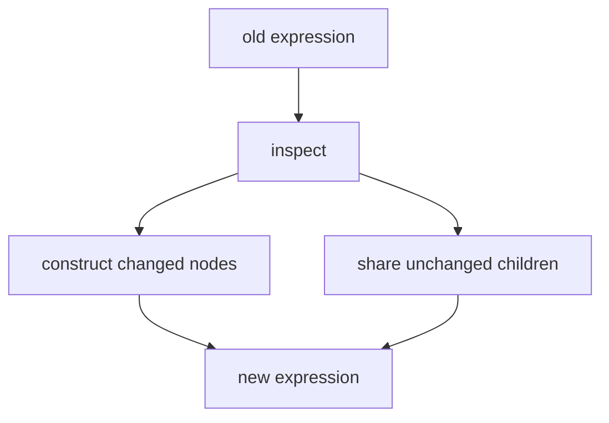
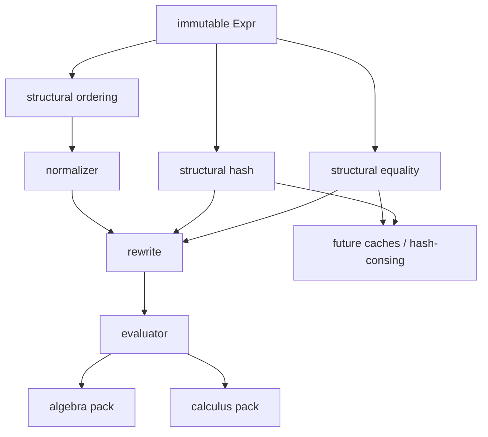

# Expression Core Refactor Plan

## Purpose

This plan stages a refactor of Aleph3's expression core before substantially
expanding CAS behavior. The goal is to make kernel expressions persistent
immutable values with first-class structural identity, structural hashing, and
deterministic structural ordering.

The refactor must preserve current external mathematical behavior. It must not
add new mathematics or broaden the supported symbolic subset.

## Objectives

- make constructed expressions immutable;
- move structural equality into the expression foundation;
- add structural hashing with the contract that structurally equal expressions
  have identical structural hashes;
- add deterministic structural ordering for canonicalization;
- remove semantic dependence on `to_string` and `to_string_raw`;
- keep printing as presentation only;
- prepare the architecture for future interning, hash-consing, and DAG sharing.

## Non-Goals

This refactor does not include:

- arbitrary-precision integers;
- numeric tower redesign;
- mathematical simplification changes;
- parser syntax changes;
- SDK semantic changes;
- notebook or web architecture changes;
- global expression interning or hash-consing;
- `SymbolId` or head interning;
- replacement of the current `std::variant` expression representation;
- new CAS functionality.

## Current Findings

The current expression representation is viable for staged strengthening:

- `Expr` is the single semantic representation and is implemented as a
  `std::variant` over atoms and composite forms.
- `ExprPtr` is currently mutable as `std::shared_ptr<Expr>`.
- Most evaluator, rewrite, transform, algebra, and pack code already rebuilds
  expressions instead of mutating existing expression nodes.
- The main blocker is API mutability: expression alternatives expose public
  fields and mutable children through mutable shared pointers.
- `kernel::structurally_equal` already exists, but it is owned by rewrite
  rather than the expression foundation.
- Several semantic identity and ordering paths still use rendering.

Known semantic rendering dependencies to migrate include:

- normalizer canonical keys and tie-break ordering;
- rewrite coefficient buckets;
- rewrite power buckets;
- evaluator `expr_to_key`;
- divide identity checks;
- known symbolic unary lookup keys;
- domain restriction deduplication and ordering;
- assumption exact-form storage;
- exact equivalence shortcut checks;
- algebra factor sorting tie-breaks.

The initial inspection did not find a broad pattern of transforming existing
`FunctionCall::args` or `List::elements` in place through an expression pointer.
Most local vector edits copy children first and construct a new expression.

## What Is Wrong With The Current Implementation

The current implementation works for the present supported subset, but it does
not provide the expression identity foundation needed for deeper CAS work.

The main problems are architectural rather than immediate user-visible bugs:

- expression nodes are mutable after construction because `ExprPtr` is
  `std::shared_ptr<Expr>`, and composite nodes expose mutable public child
  vectors and fields;
- sharing an `ExprPtr` is therefore not a strong value-sharing guarantee,
  because another holder could mutate the same node;
- structural equality exists in the rewrite subsystem, even though expression
  identity is more foundational than rewriting;
- the normalizer and several simplification/algebra paths still use printed
  expression text as equality keys, ordering keys, or deduplication keys;
- `to_string_raw` is not injective enough to be a semantic key, especially for
  nested operator forms where raw printing intentionally drops presentation
  parentheses;
- rendering choices can therefore accidentally affect canonicalization,
  grouping, equivalence shortcuts, assumptions, or domain restriction storage;
- there is no first-class structural hash, so code that wants efficient
  expression identity either scans linearly or invents ad hoc string keys;
- deterministic ordering is split across normalizer-specific helpers and
  rendering tie-breaks instead of being an expression-structure contract;
- defensive cloning remains in places where immutable sharing should eventually
  be correct and cheaper.

These issues are manageable now because the expression system is still small.
They become harder to fix after broader solving, integration, assumptions,
memoization, caches, or more algebraic transformations depend on the current
mutable and string-keyed behavior.

The refactor should therefore establish this invariant before expanding the CAS
surface:

```text
Expression = immutable value + structural equality + structural hash +
deterministic structural ordering
```

## Target Invariant

After the refactor, a constructed expression is immutable:

```cpp
ExprPtr expr = ...;
```

represents a persistent mathematical value. Transformations inspect existing
expressions and construct new expressions, potentially sharing unchanged
subexpressions.



No subsystem may rely on mutating an expression node after construction.

## Target Dependency Shape

Structural identity belongs below normalization, rewriting, evaluation, and
packs.



The expression layer must not depend on evaluator, SDK, packs, web, notebook,
or session code.

## Proposed API

Add an expression-owned structural identity header, likely:

```text
include/expr/ExprStructural.hpp
src/expr/ExprStructural.cpp
```

Initial API:

```cpp
namespace aleph3 {

[[nodiscard]] bool structural_equal(
    const ExprPtr& lhs,
    const ExprPtr& rhs) noexcept;

[[nodiscard]] std::size_t structural_hash(
    const ExprPtr& expr) noexcept;

struct ExprEqual {
    bool operator()(const ExprPtr& lhs, const ExprPtr& rhs) const noexcept;
};

struct ExprHash {
    std::size_t operator()(const ExprPtr& expr) const noexcept;
};

struct ExprStructuralLess {
    bool operator()(const ExprPtr& lhs, const ExprPtr& rhs) const noexcept;
};

}  // namespace aleph3
```

During migration, keep `kernel::structurally_equal` as a compatibility wrapper
that delegates to `aleph3::structural_equal`. Do not maintain two independent
recursive equality implementations.

Structural equality compares expression tree shape and stored values. It is not
mathematical equivalence. For example, `x + x` and `2*x` are not structurally
equal unless a normalization or simplification step has produced the same
representation.

Structural hashing recursively hashes expression structure and expression
alternative type. It must not use object addresses or rendered strings. Hashes
may be computed on demand in this refactor; cached hashes and interning are
future work.

Structural ordering is a deterministic total ordering over expression
structure for canonicalization. It is not mathematical `<`. It must be
independent of rendering.

## Migration Sequence

```mermaid
flowchart LR
    Current["mutable ExprPtr and rendering-based identity in places"]
    Tests["characterization tests"]
    Immutable["immutable ExprPtr"]
    Equal["expr-owned equality"]
    Hash["structural hash"]
    Less["structural ordering"]
    Strings["remove semantic string keys"]
    Clones["remove defensive clones"]
    Docs["architecture docs"]

    Current --> Tests
    Tests --> Immutable
    Immutable --> Equal
    Equal --> Hash
    Hash --> Less
    Less --> Strings
    Strings --> Clones
    Clones --> Docs
```



Each slice should compile and pass its relevant tests independently.

### Slice 1: Characterization Tests

Add focused tests for current structural identity behavior without changing
implementation.

Cover:

- atoms: symbols, numbers, rationals, booleans, strings, infinities;
- function calls: equal head and ordered arguments;
- structural inequality for different heads, arity, arguments, and argument
  order;
- lists;
- rules;
- assignments;
- function definitions and default parameters;
- nested expressions;
- distinction between structural equality and mathematical equivalence;
- normalization idempotence using structural equality.

Verification:

```text
aleph3_symbolic_tests
```

### Slice 2: Immutable Expression Ownership

Change the pointer contract toward:

```cpp
using ExprPtr = std::shared_ptr<const Expr>;
```

or the closest clean equivalent. Fix compile errors by preserving the
construct-new-expression pattern.

Rules:

- no `const_cast`;
- no hidden mutable aliases;
- no mutation APIs for expression nodes;
- state tables may replace expression pointers, but must not mutate pointed
  nodes.

Verification:

```text
cmake --build build --config Release
ctest --test-dir build -C Release --output-on-failure
```

On Windows, use the sanitized MSBuild environment from `AGENTS.md`.

### Slice 3: Expression-Owned Structural Equality

Move the recursive structural equality implementation into `expr`.

Update rewrite, matcher, tests, and callers to use the expression-owned API or
the temporary compatibility wrapper.

Verification:

```text
aleph3_symbolic_tests
aleph3_sdk_tests
```

### Slice 4: Structural Hashing

Add structural hash APIs and tests.

Tests must prove:

- structurally equal expressions have equal hashes;
- common unequal expressions generally produce different hashes;
- shared instances and independently constructed equal trees hash equally;
- normalized permutations hash equally after normalization.

Do not require unique hashes for all unequal expressions.

### Slice 5: Deterministic Structural Ordering

Add `ExprStructuralLess` and migrate normalizer tie-breaks away from rendered
strings.

Preserve current canonical output where practical. If preserving a printed
order conflicts with a cleaner explicit structural order, discuss the tradeoff
before changing externally observed output.

Verification:

```text
aleph3_symbolic_tests
```

with emphasis on normalizer, simplify, rewrite, algebra, and calculus tests.

### Slice 6: Remove Semantic Rendering Keys

Classify every `to_string` and `to_string_raw` use as presentation/debug or
semantic identity.

Migrate semantic identity sites to structural equality, hashing, or ordering.

Expected migrations include:

- rewrite coefficient and power buckets;
- divide self-cancellation identity;
- exact equivalence fast path;
- domain restriction deduplication and ordering;
- assumption exact-form storage;
- normalizer helper cleanup after Slice 5.

Legitimate presentation uses remain:

- printing;
- CLI/session output;
- diagnostics;
- logs;
- explicit serialization or display text.

### Slice 7: Remove Unnecessary Cloning

Review `clone_expr` helpers and `std::make_shared<Expr>(*expr)` use.

When immutability makes sharing correct, return existing `ExprPtr` values
instead of copying nodes. Keep copies only where new semantic construction is
actually required.

Add or retain tests proving shared subexpressions remain unchanged after
transforming a parent expression.

### Slice 8: Documentation And Sanity Checks

Update architecture documentation after implementation proves the final shape.

At minimum update:

- `docs/architecture.md`;
- `docs/kernel_design_spec.md`;
- `docs/kernel_rewrite_spec.md`;
- `docs/README.md` if document navigation changes.

Document:

- expression immutability;
- structural equality versus mathematical equivalence;
- structural hash contract;
- structural ordering and its independence from rendering;
- future hash-consing and DAG sharing as enabled but not implemented.

Add focused performance sanity checks only if existing infrastructure makes
them lightweight. Representative workloads include repeated normalization,
larger structural comparisons, larger `Plus`/`Times` expressions, and existing
expand/differentiation cases.

## Acceptance Criteria

The refactor is complete when:

- expression nodes are immutable after construction;
- one canonical structural equality implementation is owned by the expression
  foundation;
- structural hashes satisfy `structural_equal(a, b) => structural_hash(a) ==
  structural_hash(b)`;
- canonical ordering does not require rendering expressions to strings;
- semantic identity logic does not depend on `to_string` or `to_string_raw`;
- printing remains presentation only;
- normalization remains deterministic and idempotent;
- algebra, calculus, evaluator, parser, SDK, notebook, and web regression
  tests pass where affected;
- the architecture remains compatible with future hash-consing;
- no global expression intern table is introduced;
- no numeric tower redesign, `SymbolId` migration, variant redesign, parser
  syntax change, SDK semantic change, or new math feature is mixed in;
- architecture and kernel docs describe the new expression ownership and
  structural identity contracts.

## Final Verification

Expected final verification:

```text
git diff --check
cmake --build build --config Release
ctest --test-dir build -C Release --output-on-failure
```

Run more focused targets between slices, but do not claim completion until the
affected full test set passes or any unrelated failures are documented.
