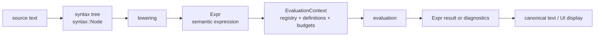
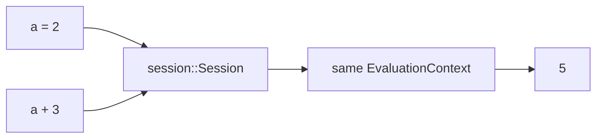
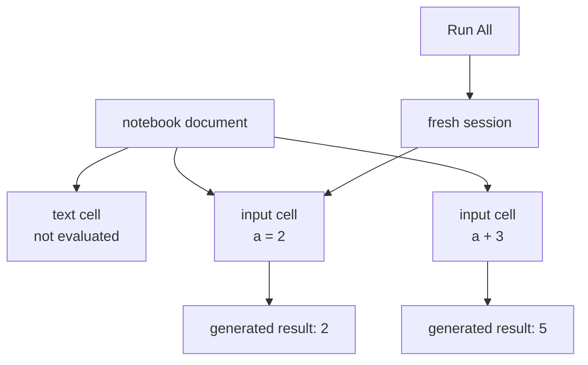

# Concepts And Terminology

This glossary defines the vocabulary used across the Aleph3 manual,
specifications, and architecture documents. Examples use the current
Wolfram-like surface syntax, but the concepts are independent of a particular
parser.

## Engine Mental Model



The most important distinction is between syntax, semantics, and presentation.
Syntax records what the user wrote. `Expr` records the expression that the
kernel evaluates. Display text is how a result is shown to a person.

## Formula

A **formula** is source text submitted through the SDK trusted subset.

```text
If[temperature > limit, "alarm", "ok"]
```

The SDK treats formulas as host-provided code that must pass schema and policy
checks before evaluation.

## Expression

An **expression** is the kernel's structured representation of meaning.
Function calls, arithmetic, rules, lists, assignments, symbols, and literal
values are all expressions.

```text
source:      x + 2
expression:  Plus[x, 2]
```

Expressions are the objects evaluated by the kernel. Source text and UI output
are not substitutes for expression identity.

## Value

A **value** is a result the SDK can return to a host application: a number,
boolean, string, or another supported public type.

```text
formula:  x + 1
binding:  x = 2
value:    3
```

A symbolic expression is not automatically an SDK value. `x + 1` may remain
symbolic if `x` has no runtime value and the caller is using a symbolic
surface.

## Head And Argument

A function-shaped expression has a **head** and zero or more **arguments**.
In `Clamp[x, 0, 10]`, `Clamp` is the head and `x`, `0`, and `10` are
arguments. Arithmetic is represented the same way: `x + 2` has the normalized
shape `Plus[x, 2]`.

This uniform shape matters because matching, evaluation, and registration can
reason about all calls through the same model.

## Kernel

The **kernel** is the semantic center: it decides what expressions mean. It
owns evaluation, symbols, definitions, rewriting, normalization, exact
arithmetic, assumptions, diagnostics, budgets, and registration contracts.

Example: the fact that exact `1/2 + 1/3` produces `5/6` is a kernel concern.
Whether a host application permits division at all is an SDK policy concern.

## `Expr`

`Expr` is the kernel semantic representation. It is the object passed to
kernel evaluation, rewriting, assumptions, and pack algorithms.

```text
D[x^2 + 3*x, x]
```

The parser and symbolic lowering produce an `Expr` whose head is `D` and whose
first argument is a normalized sum. The `core-calculus` pack then handles that
registered call.

## `syntax::Node`

`syntax::Node` is the shared parsed-source tree. It records source structure
and spans for diagnostics, but it does not define symbolic meaning by itself.

```text
source:       x - 2
syntax idea:  subtraction node with source span
```

Both the symbolic path and the SDK trusted path start from this source-aware
syntax layer.

## `ir::Node`

`ir::Node` is an SDK-side intermediate representation used after
trusted-subset lowering. It is temporary and validated by `Schema` and
`Policy` before it is lowered into `Expr`.

`ir::Node` is not a second evaluator representation. It exists so the SDK can
reject unknown variables, disallowed calls, malformed trusted formulas, and
policy violations before runtime.

## Lowering

**Lowering** translates one representation into another representation closer
to kernel execution.

```text
SDK subtraction node:  x - 2
kernel expression:      Plus[x, Times[-1, 2]]
```

"Lower" does not mean less capable. It means moving from syntax-oriented
structure to the canonical structure consumed by the execution layer.

## Evaluation

**Evaluation** resolves an expression according to values, definitions,
attributes, assumptions, budgets, and registered functions.

```text
input:   Plus[2, 3]
output:  5
```

If no applicable meaning is known, symbolic evaluation can preserve the
expression:

```text
input:   Mystery[x]
output:  Mystery[x]
```

This symbolic fallback is why the kernel is not merely a numeric calculator.

## Evaluation Context

An **evaluation context** is the mutable kernel environment used for one SDK
engine or one interactive session. It contains the active function registry,
session-local symbol values, user function definitions, assumptions, and
runtime budget counters.

```text
a = 2
a + 3  -> 5
```

The second expression sees `a = 2` only because both requests use the same
context. A clean notebook `Run All` constructs a fresh session and context
before replaying cells.

## Function Registry

A **function registry** is the catalog of callable behavior available to an
evaluation context. Builtins, pack functions, and host functions enter the
engine through registration.

```text
registered pack function:  Factor
owning package:            core-algebra
example:                   Factor[x^2 - 1] -> (x - 1) * (x + 1)
```

Registration makes ownership explicit. The CLI, web, notebook, and SDK should
query shared registry/session metadata for completion and help instead of
maintaining separate catalogs.

## Builtin, Pack Function, And Host Function

A **builtin** is implemented by Aleph3's core engine. A **pack function** is
implemented by a mathematical pack over kernel contracts. A **host function**
is supplied by an embedding application through the SDK.

```text
host registers: PriceForSku[String] -> Number
formula calls:  PriceForSku["ABC-123"] * quantity
```

Registration is engine-scoped: one application's functions do not silently
appear in another engine instance.

## Pack

A **pack** is a domain library built on kernel contracts. It contributes
registered functions, rules, or algorithms without changing the evaluator's
architecture.

Current examples:

- `core-algebra` owns focused polynomial operations and exact dense matrices.
- `core-calculus` owns focused symbolic differentiation through `D` and
  `Differentiate`.

The kernel provides pattern matching and expression evaluation; a pack
provides domain knowledge such as polynomial factorization or derivative
rules.

## Session

A **session** owns interactive execution state across requests, including user
definitions and one kernel evaluation context. The CLI REPL, headless notebook
runner, internal engine service, and transitional web API core use this
boundary.



Resetting a session discards session-local definitions and starts from the
same registered builtin and pack catalog. It is different from clearing one
symbol with `Clear` or `Unset`.

## Notebook Document, Cell, And Generated Result

A **notebook document** is an ordered collection of cells plus portable
metadata. It is product data, not a second expression representation.

An **input cell** stores Aleph3 source text. A **text cell** stores
explanatory content. A **generated result** records presentation associated
with evaluating an input cell.



Cached generated results are not semantic truth. Loading a notebook preserves
the cache as data and never evaluates source. Re-running the notebook replaces
the cache from a fresh session.

## BFF And Internal Engine Service

The **BFF** is the ASP.NET Core backend-for-frontend that owns public browser
routes under `/api/*` in the Web MVP path. It validates public request shape
and delegates computation to the internal C++ engine service.

The **internal engine service** owns symbolic sessions over `/internal/*`.
It uses `session::Session`, the kernel, and registered packs. It does not own
browser cookies, notebook ownership, product persistence, or public account
policy.

```text
browser -> BFF /api/* -> engine /internal/* -> session -> kernel + packs
```

## Schema And Policy

A **schema** describes names and types available to a formula. A **policy**
describes permitted operations and resource limits.

```text
schema:   x is Number, label is String
policy:   allow If and Clamp; maximum expression depth 32
formula:  If[x > 10, label, "small"]
```

The schema answers "does this name exist, and what kind of value is it?" The
policy answers "is this operation allowed, and within what budget?"

## Definition And Attribute

A **definition** attaches behavior or a value to a symbol. An **attribute**
changes how evaluation treats a head and its arguments.

For example, an `If`-like head must avoid evaluating both branches before it
knows the condition; an evaluation-control attribute can express that rule.
Attributes affect scheduling, while definitions provide results.

## Free Variable, Bound Variable, And Capture

A **free variable** is a symbol an expression genuinely depends on in the
current structural scope. A **bound variable** is introduced by a supported
binder such as a function-definition parameter or a named pattern binder.

```text
FreeVariables[f[a_] -> g[a, y]]   -> {y}
BoundVariables[f[a_] -> g[a, y]]  -> {a}
```

Substitution must avoid **capture**. If replacing `y` with `x` inside
`f[x_] := y` made the inserted `x` refer to the function parameter, the
meaning would change. The kernel's first capture-safe substitution contract
skips that replacement rather than renaming binders.

## Rewrite, Rule, Pattern, And Match

A **rule** describes a structural replacement. A **pattern** describes which
structures it accepts. A **match** binds pattern names to actual
subexpressions.

```text
rule:        f[a_] -> g[a]
expression:  f[x]
binding:     a = x
result:      g[x]
```

A **rewrite** is the act of applying such a rule. Rewriting differs from
evaluation: `2 + 3 -> 5` computes a built-in meaning, while `f[a_] -> g[a]`
performs a caller-directed structural transformation.

Rewrites are bounded because a rule such as `a_ -> f[a]` could otherwise run
forever.

## Replacement Depth

The root expression is depth `0`; its arguments are depth `1`; their arguments
are depth `2`, and so on. Function head names are not counted as children.

```text
expression: f[f[x], x]

Replace[f[f[x], x], x -> y, 1]       -> f[f[x], y]
Replace[f[f[x], x], x -> y, 2]       -> f[f[y], x]
Replace[f[f[x], x], x -> y, {1, 2}]  -> f[f[y], y]
```

The last argument is either one exact depth or an inclusive `{min, max}` range.
Omitting it preserves the existing whole-expression traversal. Aleph3
currently supports nonnegative depths only; negative levels and traversal of
head names are intentionally outside this contract.

## Conditional Pattern

A **conditional pattern** adds a predicate after structural matching. Bindings
are substituted into the predicate, which is evaluated with the same session
budget as the rewrite.

```text
Condition[n_Integer, Positive[n]]
Replace[3, Condition[n_Integer, Positive[n]] -> g[n]]  -> g[3]
```

Only an exact `True` accepts the match. `False` and unresolved predicates do
not match. Sequence and nested conditional patterns remain unsupported.

## Normalization

**Normalization** gives equivalent expression structures a predictable
canonical shape. For example, nested addition may be flattened and terms may
be placed in a deterministic order.

Normalization is not "make this as simple as a human would." Its goal is
stable structure. That stability makes equality checks, caching, and rewrite
matching reliable.

## Exact Arithmetic

**Exact arithmetic** preserves mathematical values without rounding when the
supported representation allows it. `1/3` remains a rational value rather
than becoming an approximate binary floating-point number.

```text
1/3 + 1/6  -> 1/2
```

Exactness is a contract, not a claim that every mathematical object is already
supported. The algebra specifications state the current boundary.

## Approximate Arithmetic

**Approximate arithmetic** uses machine-real values and is subject to ordinary
floating-point behavior. Decimal input is already approximate.

```text
0.1 + 0.2
```

Use exact integer or rational input when exact preservation matters.

## Polynomial Vocabulary

A **polynomial** is a sum of terms made from coefficients and variables raised
to nonnegative integer powers:

```text
3*x^2*y + 1/2*y - 4
```

In this expression:

- `3`, `1/2`, and `-4` are coefficients.
- `x^2*y` and `y` are monomials, the variable-and-exponent parts.
- `3*x^2*y`, `1/2*y`, and `-4` are terms.
- The polynomial is multivariate because it contains more than one variable.

A univariate polynomial uses one variable, such as `x^3 - 2*x + 1`.
Multivariate does not mean "multiple equations"; it means one polynomial whose
terms may involve multiple variables.

## Canonical Monomial Order

A multivariate polynomial needs a deterministic rule for deciding which term
comes first. Aleph3's current canonical order compares:

1. Total degree, the sum of a monomial's exponents.
2. Variable exponents in the declared precedence order.

For example, both `x^2*y` and `x*y^2` have total degree three. With precedence
`{x, y}`, `x^2*y` comes first because it has the larger exponent of `x`. This
policy is called **graded lexicographic order**.

The order is not cosmetic. Polynomial division repeatedly works with the
leading term, so changing variable precedence can change the quotient and
remainder while preserving the same reconstruction identity.

## Multivariate Polynomial Division

`PolynomialQuotient[dividend, divisor, {x, y}]` performs exact division by one
divisor. `{x, y}` declares that `x` has precedence over `y`.

```text
PolynomialQuotient[x^2*y + x*y^2 + y, x*y, {x, y}]
    -> {x + y, y}
```

The two outputs are `{quotient, remainder}` and satisfy:

```text
dividend = divisor * quotient + remainder

x^2*y + x*y^2 + y = x*y * (x + y) + y
```

Aleph3 currently supports this operation only for exact integer or rational
coefficients and an explicit variable list. Floating-point multivariate
division, multiple divisors, general multivariate GCD, and broad multivariate
factorization remain outside the supported subset. See the
[algebra contract](../algebra_supported_subset.md) for the precise boundary.

## Assumption

An **assumption** is contextual knowledge used to justify a transformation.
Without assumptions, `Sqrt[x^2]` cannot generally become `x`; for negative
real `x`, the result is `-x`. With `x >= 0`, that simplification is valid.

```text
Refine[Sqrt[x^2], x >= 0]  -> x
```

Assumptions never license a transformation that is merely convenient. The
kernel or a pack must be able to justify it from supported facts.

## Dense Matrix

A **dense matrix** is a rectangular rank-two array that stores every entry.
Aleph3 writes matrices as nested lists such as `{{1, 2}, {3, 4}}`; the algebra
pack validates that shape and converts it to a typed row-major value while it
computes. This does not make every nested list a matrix or introduce a general
tensor type.

```text
Det[{{1, 2}, {3, 4}}]  -> -2
```

## Diagnostic

A **diagnostic** explains a problem found while parsing, validating, or
evaluating. Diagnostics have machine-readable codes and human-readable
messages, and may carry source spans where the caller has source context.

```text
D[x, {x, -1}]  -> kernel.invalid_form
```

Structured diagnostics let applications display errors without scraping
strings.

## Runtime Error

A **runtime error** reports a failure that occurs during execution, such as a
budget exhaustion, invalid runtime input, unsupported form, or host callback
failure. SDK callers receive runtime errors through the public SDK boundary;
session and web callers receive diagnostics or public error envelopes
according to their contract.

## Budget

A **budget** bounds work: evaluation steps, rewrite passes, expression size,
request body size, notebook size, or related resources. It turns accidental or
adversarial nontermination into a controlled error.

Budgets are part of safe embedding and public service operation, not a
performance afterthought. A formula can be mathematically valid and still
exceed the work a host permits.

## Symbolic Fallback

**Symbolic fallback** preserves a well-formed expression when no concrete
result is available. It allows later definitions, assumptions, or packs to
make progress without treating every unknown as an error.

```text
UnknownFunction[x]  -> UnknownFunction[x]
```

The trusted SDK may reject some unknown names earlier because its contract is
deliberately narrower. That is a useful example of the difference between
kernel semantics and SDK policy.
