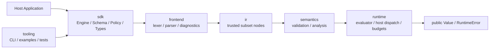
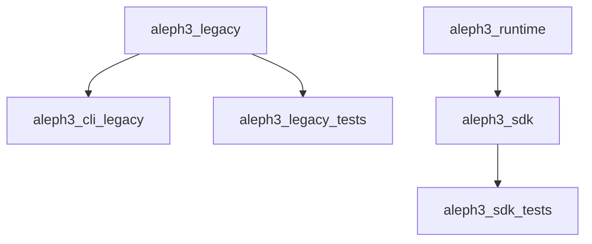

# Rewrite Docs

This directory is the working index for the embedded-engine rewrite. The older
top-level documents remain the detailed source material; these subdocs make the
rewrite easier to navigate as the SDK-first implementation grows.

## What Is Stable Now

- Public SDK headers under `include/sdk/`
- Minimal trusted-subset IR in `include/ir/Node.hpp`
- Rewrite lexer, parser, and type-aware validator
- Reusable `CompiledFormula` creation through `Engine::compile()`
- Trusted-subset runtime evaluation through `Engine::evaluate()`
- Engine-scoped host function contracts with runtime argument/return enforcement
- Rewrite build target split in `CMakeLists.txt`
- Rewrite tooling CLI target `aleph3_rewrite_cli`
- Rewrite REPL, built-in help/examples, `evaluate --var ...`, and `evaluate-host` support in `aleph3_rewrite_cli`
- Rewrite example target `aleph3_rewrite_sdk_example` for host-app embedding
- Contract direction defined by the top-level rewrite docs

## What Is Not Stable Yet

- Broader static validation beyond the current numeric/boolean/function checks
- Custom host-function injection into the CLI beyond the built-in demo bundle
- Packaging and final target names

## Document Map

- [Stable Interfaces](stable_interfaces.md)
- [Build And Targets](build_and_targets.md)
- [Testing Strategy](testing_strategy.md)
- [Migration Notes](migration_notes.md)

## Rewrite Layer Diagram

## Rewrite Build Diagram

