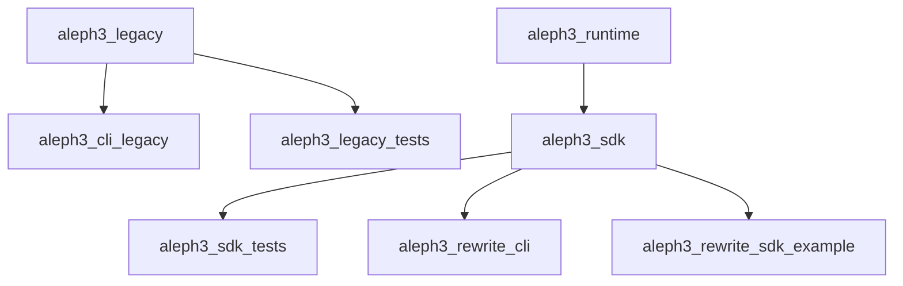

# Build And Targets

The build now distinguishes the legacy prototype from the rewrite path so the
new SDK can compile without pulling in old parser/evaluator internals.

## Targets

| Target | Type | Purpose |
| --- | --- | --- |
| `aleph3_legacy` | library | Existing prototype engine |
| `aleph3_cli_legacy` | executable | Existing CLI built on the legacy engine |
| `aleph3_runtime` | interface library | Rewrite include boundary placeholder for runtime-facing layers |
| `aleph3_sdk` | library | Rewrite public SDK facade |
| `aleph3_rewrite_cli` | executable | Thin rewrite tooling CLI for manual SDK/frontend checks |
| `aleph3_rewrite_sdk_example` | executable | Minimal host-app example using registered demo host functions |
| `aleph3_legacy_tests` | executable | Existing prototype tests |
| `aleph3_sdk_tests` | executable | Rewrite SDK and IR tests |

## Build Options

- `ALEPH3_BUILD_LEGACY=ON|OFF`
- `ALEPH3_BUILD_REWRITE=ON|OFF`
- `BUILD_TESTING=ON|OFF`

## Target Dependency Diagram

## Practical Guidance

- Use `ALEPH3_BUILD_REWRITE=ON` to work on the new embedded-engine path.
- Use `aleph3_rewrite_cli` for fast manual checks while broader validation and custom host-function tooling are still under construction.
- `validate` in the rewrite CLI now exercises the real lexer/parser/validator path.
- `evaluate` in the rewrite CLI now accepts `--var name=value` bindings for basic runtime checks.
- `evaluate-host` in the rewrite CLI registers demo host functions for end-to-end SDK checks.
- `aleph3_rewrite_sdk_example` is the smallest compiled host-app integration reference in the repo.
- Use `ALEPH3_BUILD_LEGACY=ON` only while mining the prototype for reference behavior.
- Use `BUILD_TESTING=OFF` for offline or dependency-restricted compile checks.
- Keep new rewrite components linked only through rewrite targets unless a legacy dependency is explicitly justified.
