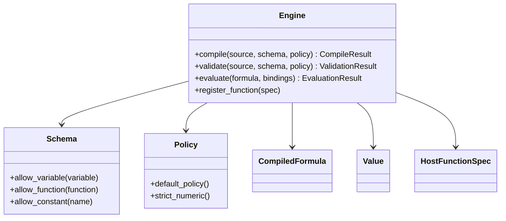

# Stable Interfaces

This document marks the interfaces that should now be treated as the rewrite
boundary. They are stable enough to build against, but not yet feature-complete.

## Status Table

| Surface | Status | Notes |
| --- | --- | --- |
| `sdk/Types.hpp` | provisional stable | Public value model, diagnostics, opaque `CompiledFormula`, host function metadata |
| `sdk/Schema.hpp` | provisional stable | Host allowlists for variables, functions, and constants |
| `sdk/Policy.hpp` | provisional stable | Structural/runtime limits and feature flags |
| `sdk/Engine.hpp` | provisional stable | Main facade; methods link and return structured placeholders |
| `ir/Node.hpp` | internal stable | Trusted-subset IR for parser, validation, and runtime work |

## Public SDK Boundary

## Stable Design Rules

- Host applications must not depend on legacy AST types such as `Expr`.
- The public SDK must remain usable without including parser or evaluator headers.
- `CompiledFormula` remains opaque until the frontend and runtime are ready.
- `ir::Node` is for internal rewrite layers only and must not leak into the SDK.
- Engine-scoped host function registration replaces the legacy global registry model.

## Current Guarantees

- SDK headers compile independently of legacy headers.
- The engine facade links with a concrete implementation.
- Placeholder diagnostics and runtime errors are structured and predictable.
- The IR only models the trusted subset, not the full prototype language.

## Known Gaps

- No parser or validator implementation yet.
- No compiled-formula production path yet.
- No runtime evaluation path yet.
- No explicit source canonicalization or serialization yet.
