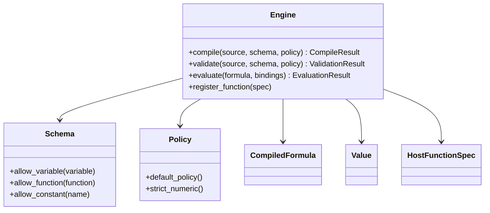

# Stable Interfaces

This document marks the interfaces that should now be treated as the rewrite
boundary. They are stable enough to build against, but not yet feature-complete.

## Status Table

| Surface | Status | Notes |
| --- | --- | --- |
| `sdk/Types.hpp` | provisional stable | Public value model, diagnostics, opaque `CompiledFormula`, and host function metadata/contracts |
| `sdk/Schema.hpp` | provisional stable | Host allowlists for variables, functions, and constants |
| `sdk/Policy.hpp` | provisional stable | Structural/runtime limits and feature flags |
| `sdk/Engine.hpp` | provisional stable | Main facade; `validate`, `compile`, and trusted-subset `evaluate` are live |
| `ir/Node.hpp` | internal stable | Trusted-subset IR for parser, validation, and runtime work |
| `frontend/Lexer.hpp` + `frontend/Parser.hpp` | internal stable | Trusted-subset syntax frontend with structured diagnostics |
| `semantics/Validator.hpp` | internal stable | Schema, arity, feature-gate, and first-pass type validation for the rewrite subset |
| `runtime/Evaluator.hpp` | internal stable | Trusted-subset tree interpreter with bindings, `If`, comparisons, and host dispatch |

## Public SDK Boundary

## Stable Design Rules

- Host applications must not depend on legacy AST types such as `Expr`.
- The public SDK must remain usable without including parser or evaluator headers.
- `CompiledFormula` remains opaque even though the frontend and runtime are now live.
- `ir::Node` is for internal rewrite layers only and must not leak into the SDK.
- Engine-scoped host function registration replaces the legacy global registry model.

## Current Guarantees

- SDK headers compile independently of legacy headers.
- The engine facade links with a concrete implementation.
- Validation produces structured diagnostics for syntax, schema, arity, feature-gate, and obvious type failures.
- Compile produces reusable opaque `CompiledFormula` handles on successful parse + validation.
- Evaluate executes the trusted subset for literals, bindings, arithmetic, comparisons, `If`, and registered host calls.
- Registered host functions enforce arity/parameter metadata at registration and argument/return contracts at runtime.
- The IR only models the trusted subset, not the full prototype language.

## Known Gaps

- No explicit source canonicalization or serialization yet.
- CLI evaluation currently supports numbers, booleans, and string bindings through `--var name=value`.
- Optional built-ins and richer host-function tooling ergonomics are still limited on the tooling path.
