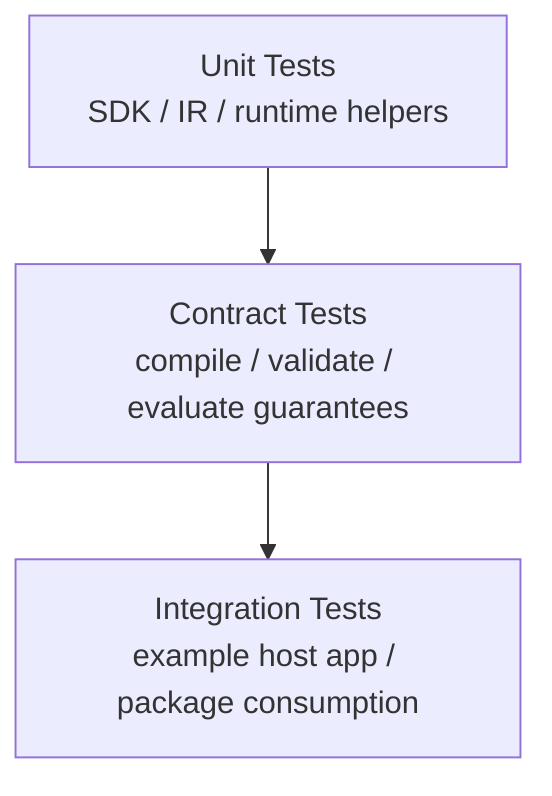

# Testing Strategy

The rewrite needs a smaller and stricter test strategy than the prototype.
Legacy tests remain useful as reference material, but they do not define truth
for the new embedded engine.

## Testing Layers

## Current Rewrite Test Coverage

- `tests/sdk/EngineTests.cpp`
  Confirms the SDK facade links, validates formulas, compiles reusable formula handles, and returns structured errors.
- `tests/sdk/TypesTests.cpp`
  Verifies stable public value, schema, and policy behavior.
- `tests/frontend/LexerTests.cpp`
  Verifies tokenization, spans, and lexer diagnostics.
- `tests/frontend/ParserTests.cpp`
  Verifies precedence, grouping, calls, `If`, and parse failures.
- `tests/ir/NodeTests.cpp`
  Verifies the trusted-subset IR shape and construction helpers.
- `tests/semantics/ValidatorTests.cpp`
  Verifies unknown-symbol, arity, feature-gate, and structural-limit checks.
- `tests/runtime/EvaluatorTests.cpp`
  Verifies arithmetic, comparisons, conditionals, bindings, host functions, and runtime failures.

## What Legacy Tests Still Mean

- They provide examples and edge cases worth auditing.
- They do not force compatibility with the broad prototype language.
- They should be promoted into rewrite contract tests only after feature review.

## Near-Term Contract Priorities

1. Blank or malformed source must produce structured diagnostics.
2. Unsupported syntax must fail intentionally rather than degrade into symbolic fallback.
3. Schema checks for variable and function allowlists must be deterministic.
4. Compiled formulas must be reusable opaque handles rather than reparsed SDK state.
5. Engine-scoped function registration must avoid global mutable behavior.
6. Evaluation budgets must fail with structured runtime errors.
