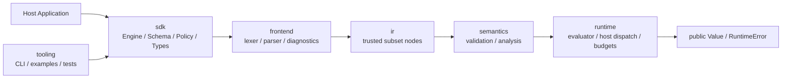
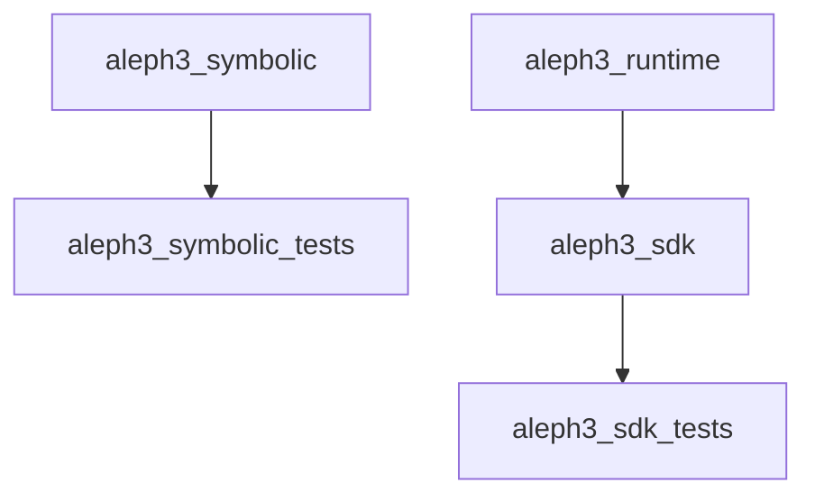

# SDK Docs

This directory is the working index for the Aleph3 SDK and primary engine.
The older top-level documents remain the detailed source material; these subdocs
make the production path easier to navigate as the SDK-first implementation grows.

## What Is Stable Now

- Public SDK headers under `include/sdk/`
- Minimal trusted-subset IR in `include/ir/Node.hpp`
- SDK lexer, parser with focused function-call coverage, and composed-expression-aware validator
- Constant-condition branch pruning for `If[...]` when the condition reduces to a trusted constant boolean during validation
- Constant runtime-trap detection for obvious cases such as division by a constant zero denominator
- Schema-valued constants flowing through validation and runtime evaluation
- Non-finite numeric arithmetic results rejected with structured runtime errors
- Explicit power-domain failures for `0 ^ 0` and negative-base fractional powers
- Signed-zero numeric results normalized to positive zero
- Mixed-type equality rejected as a type error
- Numeric comparisons reject `NaN` and infinities with structured runtime errors
- Optional SDK numeric built-ins: `Abs`, `Min`, `Max`, `Clamp`, `Floor`, `Ceil`/`Ceiling`, `Round`, `Sqrt`
- Reusable `CompiledFormula` creation through `Engine::compile()`
- Trusted-subset runtime evaluation through `Engine::evaluate()`
- Engine-scoped host function contracts with runtime argument/return enforcement
- SDK/symbolic-engine build target split in `CMakeLists.txt`
- Aleph3 CLI target `aleph3_cli`
- Aleph3 CLI REPL, built-in help/examples, `host-functions`, `evaluate --var ...`, and `evaluate-host`
- When the symbolic engine is built, `aleph3_cli` also exposes `symbolic-evaluate`, `symbolic-simplify`, and `symbolic-fullform`
- The symbolic polynomial tier now supports product-facing `Expand`, `Factor`, `Collect`, `GCD`, and `PolynomialQuotient` from that CLI surface
- SDK example target `aleph3_sdk_example` for host-app embedding
- Contract direction defined by the top-level SDK docs

## What Is Not Stable Yet

- Deeper flow-sensitive validation beyond current constant-condition pruning, schema-valued constant reasoning, constant runtime-trap detection, and branch/type/return checks
- Custom host-function injection into the CLI beyond the built-in demo bundle
- Packaging and final target names

## Document Map

- [Stable Interfaces](stable_interfaces.md)
- [Build And Targets](build_and_targets.md)
- [Testing Strategy](testing_strategy.md)
- [Migration Notes](migration_notes.md)
- [Math Core Audit](math_core_audit.md)

## SDK Layer Diagram

## Build Diagram

