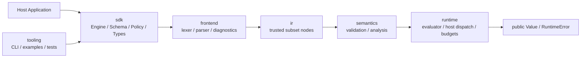
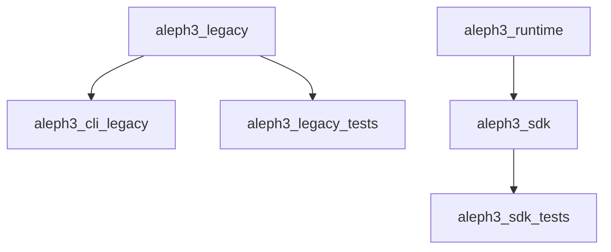

# SDK Docs

This directory is the working index for the Aleph3 SDK and primary engine.
The older top-level documents remain the detailed source material; these subdocs
make the production path easier to navigate as the SDK-first implementation grows.

## What Is Stable Now

- Public SDK headers under `include/sdk/`
- Minimal trusted-subset IR in `include/ir/Node.hpp`
- SDK lexer, parser with focused function-call coverage, and composed-expression-aware validator
- Literal-branch pruning for `If[True, ...]` and `If[False, ...]` during validation
- Reusable `CompiledFormula` creation through `Engine::compile()`
- Trusted-subset runtime evaluation through `Engine::evaluate()`
- Engine-scoped host function contracts with runtime argument/return enforcement
- SDK/legacy build target split in `CMakeLists.txt`
- Aleph3 CLI target `aleph3_cli`
- Aleph3 CLI REPL, built-in help/examples, `host-functions`, `evaluate --var ...`, and `evaluate-host`
- SDK example target `aleph3_sdk_example` for host-app embedding
- Contract direction defined by the top-level SDK docs

## What Is Not Stable Yet

- Deeper flow-sensitive validation beyond literal-branch pruning and the current branch/type/return checks
- Custom host-function injection into the CLI beyond the built-in demo bundle
- Packaging and final target names

## Document Map

- [Stable Interfaces](stable_interfaces.md)
- [Build And Targets](build_and_targets.md)
- [Testing Strategy](testing_strategy.md)
- [Migration Notes](migration_notes.md)

## SDK Layer Diagram

## Build Diagram

