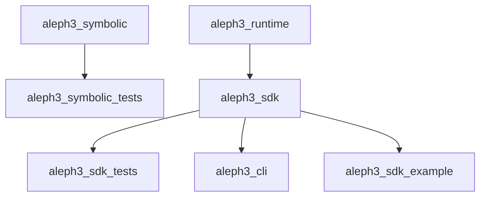

# Build And Targets

The build now distinguishes the symbolic engine from the primary SDK path so
the new engine can compile without pulling in the broader symbolic parser and
evaluator internals.

## Targets

| Target | Type | Purpose |
| --- | --- | --- |
| `aleph3_symbolic` | library | Symbolic engine core |
| `aleph3_runtime` | interface library | Runtime-facing include boundary placeholder |
| `aleph3_sdk` | library | Public SDK facade |
| `aleph3_cli` | executable | Thin SDK tooling CLI for manual parser/validator/runtime checks |
| `aleph3_sdk_example` | executable | Minimal host-app example using registered demo host functions |
| `aleph3_symbolic_tests` | executable | Symbolic engine tests |
| `aleph3_sdk_tests` | executable | Rewrite SDK and IR tests |

## Build Options

- `ALEPH3_BUILD_SYMBOLIC_ENGINE=ON|OFF`
- `ALEPH3_BUILD_SDK=ON|OFF`
- `BUILD_TESTING=ON|OFF`

## Target Dependency Diagram

## Practical Guidance

- Use `ALEPH3_BUILD_SDK=ON` to work on the primary SDK path.
- Use `aleph3_cli` for fast manual checks while broader validation and custom host-function tooling are still under construction.
- `validate` in the CLI now exercises the real lexer/parser/validator path.
- `evaluate` in the CLI now accepts `--var name=value` bindings for basic runtime checks.
- `evaluate-host` in the CLI registers demo host functions for end-to-end SDK checks.
- `aleph3_sdk_example` is the smallest compiled host-app integration reference in the repo.
- Use `ALEPH3_BUILD_SYMBOLIC_ENGINE=ON` when working on the symbolic engine core.
- Use `BUILD_TESTING=OFF` for offline or dependency-restricted compile checks.
- Keep new SDK components linked only through SDK targets unless a symbolic-engine dependency is explicitly justified.
