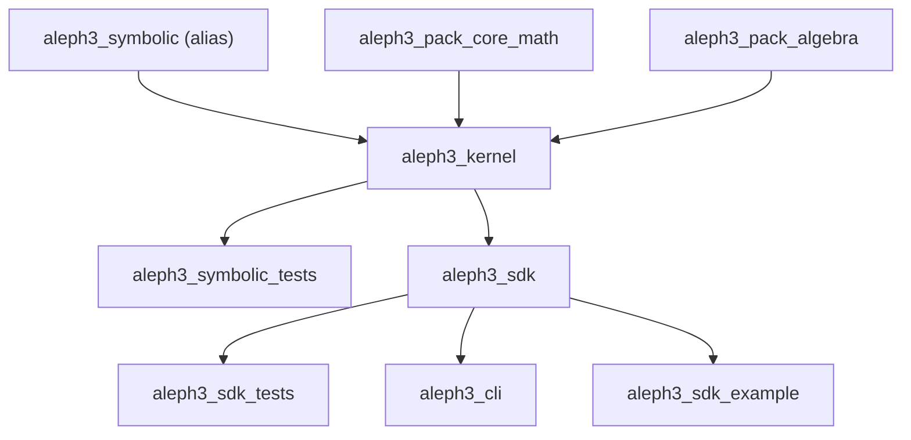

# Build And Targets

The build now distinguishes the symbolic engine from the primary SDK path so
the new engine can compile without pulling in the broader symbolic parser and
evaluator internals.

Status note:

- this split is transitional
- the target architecture is one kernel plus SDK and pack layers above it
- SDK execution is now kernel-backed
- `aleph3_sdk` depends on `aleph3_kernel` in the build graph

Related documents:

- [Aleph3 Unified Plan](../aleph3_unified_plan.md)
- [Kernel Representation Decision](../kernel_representation_decision.md)
- [Layer Ownership Matrix](../layer_ownership_matrix.md)

## Targets

| Target | Type | Purpose |
| --- | --- | --- |
| `aleph3_kernel` | library | Explicit kernel build target for the current symbolic engine surface |
| `aleph3_symbolic` | alias | Compatibility alias for the current kernel target during migration |
| `aleph3_pack_core_math` | interface library | Placeholder pack boundary for future elementary/core math extraction |
| `aleph3_pack_algebra` | interface library | Placeholder pack boundary for future algebra extraction |
| `aleph3_sdk` | library | Public SDK facade over kernel-backed execution |
| `aleph3_cli` | executable | Thin SDK tooling CLI for manual parser/validator/runtime checks |
| `aleph3_sdk_example` | executable | Minimal host-app example using registered demo host functions |
| `aleph3_symbolic_tests` | executable | Kernel-oriented symbolic tests plus current symbolic tooling and pack-placeholder coverage |
| `aleph3_sdk_tests` | executable | SDK-layer tests and SDK tooling coverage |

## Build Options

- `ALEPH3_BUILD_SYMBOLIC_ENGINE=ON|OFF`
- `ALEPH3_BUILD_SDK=ON|OFF`
- `BUILD_TESTING=ON|OFF`

Current interpretation:

- `ALEPH3_BUILD_SDK=ON` builds the SDK and the kernel it depends on
- `ALEPH3_BUILD_SYMBOLIC_ENGINE=ON` enables the broader symbolic surface and
  symbolic test target
- `ALEPH3_BUILD_SYMBOLIC_ENGINE=OFF` no longer means "no kernel at all" if the
  SDK is enabled

## Target Dependency Diagram

This diagram reflects the current build, not the desired end state.
The main immediate improvement is that the kernel now has an explicit build
name, the SDK now depends on it directly, and the first pack targets now exist
as placeholders even though the runtime collapse and pack extraction work are
not complete yet.

## Practical Guidance

- Use `ALEPH3_BUILD_SDK=ON` to work on the primary SDK path.
- Expect the kernel to build whenever the SDK is enabled.
- Use `aleph3_cli` for fast manual checks while broader validation and custom host-function tooling are still under construction.
- `validate` in the CLI now exercises the real lexer/parser/validator path.
- `evaluate` in the CLI now accepts `--var name=value` bindings for basic runtime checks.
- `evaluate-host` in the CLI registers demo host functions for end-to-end SDK checks.
- `aleph3_sdk_example` is the smallest compiled host-app integration reference in the repo.
- Use `ALEPH3_BUILD_SYMBOLIC_ENGINE=ON` when working on the symbolic engine core.
- Use `ALEPH3_BUILD_SYMBOLIC_ENGINE=OFF` when you want the SDK without the
  broader symbolic CLI/test surface, not when you want to remove the kernel
  dependency entirely.
- Treat `aleph3_pack_core_math` and `aleph3_pack_algebra` as staging boundaries
  for future extraction, not as proof that pack-owned code has already moved.
- Use `BUILD_TESTING=OFF` for offline or dependency-restricted compile checks.
- Keep new SDK components linked only through SDK targets unless a kernel
  dependency is explicitly justified.
- Do not add new permanent SDK-only execution semantics outside the
  kernel-backed path.

## Current Test Ownership Split

- `tests/evaluator`, `tests/parser`, and the structural symbolic tests in
  `tests/*.cpp` are treated as kernel-side coverage.
- `tests/algebra` remains linked through the symbolic test target for now, but
  is treated as pack-owned coverage by architecture.
- `tests/frontend`, `tests/ir`, `tests/semantics`, and `tests/sdk` are SDK-side
  coverage.
- `tests/tooling` is SDK/tooling consumer coverage.
- `tests/packs/` is reserved for explicit future pack-owned test files once
  extraction moves beyond placeholder targets.
