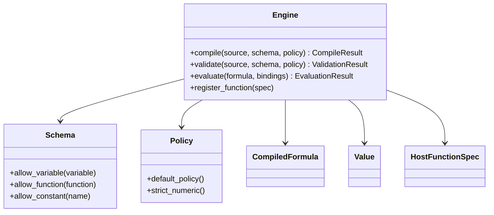

# Stable Interfaces

This document defines the public SDK surface that should survive after kernel
convergence and identifies which current SDK-facing APIs are stable versus
transitional.

## Status Table

| Surface | Status | Notes |
| --- | --- | --- |
| `sdk/Types.hpp` | stable product surface | Public value model, diagnostics, opaque `CompiledFormula`, result wrappers, and host function metadata/contracts |
| `sdk/Schema.hpp` | stable product surface | Host allowlists for variables, functions, and constants, including optional constant values |
| `sdk/Policy.hpp` | stable with transitional members | Budget controls and trusted-subset feature gates are stable; some forward-looking toggles are not yet part of the hardened product contract |
| `sdk/Engine.hpp` | stable product surface | Main facade; `validate`, `compile`, trusted-subset `evaluate`, and engine-scoped host registration are live |
| `EngineOptions` | transitional | Public constructor hook exists, but only `retain_source_text` currently affects behavior; other fields should not be treated as long-term product knobs yet |
| `ir/Node.hpp` | internal stable | Trusted-subset IR for parser and validation work |
| `frontend/Lexer.hpp` + `frontend/Parser.hpp` | internal stable | Trusted-subset syntax frontend with structured diagnostics |
| `semantics/Validator.hpp` | internal stable | Schema, arity, feature-gate, and composed-expression type validation for the trusted subset |
| `kernel/TrustedSubsetBridge.hpp` | internal stable | Trusted-subset lowering and kernel-backed execution adapter |

## Surviving Public SDK Surface

The SDK surface that should remain public after kernel convergence is:

- `Engine`
- `Schema`
- `Policy`
- `CompiledFormula`
- `CompileResult`
- `ValidationResult`
- `EvaluationResult`
- `Value`
- `Bindings`
- `Diagnostic`
- `RuntimeError`
- `HostFunctionSpec`, `HostFunctionParameter`, `HostFunctionCallback`,
  `FunctionArity`, `ValueType`, and `HostFunctionPurity`

These types define the host-facing embedding contract. They should remain
usable without exposing `Expr`, kernel contexts, lowering helpers, or parser
internals.

## Stable Vs Transitional

### Stable Product Surface

These APIs should be treated as the durable SDK contract:

- `Engine::compile`
- `Engine::validate`
- `Engine::evaluate`
- `Engine::register_function`
- `Schema` variable/function/constant allowlisting
- `Policy` budget controls and trusted-subset feature gates that already affect
  validation or evaluation
- `Value`, `Bindings`, `Diagnostic`, `RuntimeError`, and the result wrapper
  types
- host-function metadata and callback contracts
- `CompiledFormula` opacity and reusability across evaluations

### Transitional Public Members

These names are public today, but should not be treated as hardened long-term
product guarantees yet:

- `EngineOptions`
  Reason: only `retain_source_text` currently changes behavior in the engine
  implementation; the other fields are not yet a reliable external contract.
- `Policy::allow_assignments`
- `Policy::allow_user_defined_functions`
- `Policy::allow_implicit_multiplication`
- `Policy::allow_chained_comparisons`
  Reason: these toggles are forward-looking surface area that is not yet backed
  by a comparably hardened trusted-subset contract.

### Internal But Stable For Current Ownership

These surfaces are stable in the sense that their ownership is clear, but they
are not part of the host-facing SDK contract:

- `ir::Node.hpp`
- `frontend/Lexer.hpp`
- `frontend/Parser.hpp`
- `semantics/Validator.hpp`
- `kernel/TrustedSubsetBridge.hpp`

## Public SDK Boundary

## Stable Design Rules

- Host applications must not depend on internal symbolic AST types such as `Expr`.
- The public SDK must remain usable without including parser or evaluator headers.
- `CompiledFormula` remains opaque even though the frontend and kernel-backed execution path are live.
- `ir::Node` is for internal SDK frontend and validation layers only and must not leak into the SDK.
- Engine-scoped host function registration replaces the old global registry model.
- The SDK build now depends on `aleph3_kernel` even though the public SDK
  boundary still must not expose internal symbolic AST types.
- Transitional public knobs must not expand faster than their tested behavior
  and documentation.

## Current Guarantees

- SDK headers compile independently of symbolic-engine internal headers.
- The engine facade links with a concrete implementation.
- `Engine` owns an engine-scoped host-function registry and does not mutate a
  process-global host registration table.
- `CompiledFormula` is read-only after successful compilation and does not
  snapshot engine host-function registrations.
- Validation produces structured diagnostics for syntax, schema, arity, feature-gates, branch compatibility, schema-valued constants, constant runtime traps, and obvious type failures.
- Compile produces reusable opaque `CompiledFormula` handles on successful parse + validation.
- Compiled formulas retain lowered kernel execution state rather than trusted-subset IR.
- `Engine::evaluate` reads the engine's current host-function set at evaluation
  time, so formulas compiled earlier can observe later host registration on the
  same engine.
- The same compiled formula may evaluate differently across engines because
  host-function registration remains engine-scoped.
- Evaluate executes the trusted subset for literals, bindings, arithmetic, comparisons, `If`, and registered host calls.
- Optional built-ins can be enabled by policy for `Abs`, `Min`, `Max`, `Clamp`, `Floor`, `Ceil`/`Ceiling`, `Round`, and `Sqrt`.
- Schema-valued constants can participate in validation and runtime evaluation without host bindings.
- Non-finite numeric arithmetic inputs/results fail with structured runtime errors instead of leaking raw floating-point behavior.
- Numeric equality and ordering reject non-finite inputs instead of exposing raw floating-point comparison behavior.
- Invalid numeric power domains such as `0 ^ 0` and negative-base fractional powers fail with structured runtime errors.
- Built-in numeric domain failures such as `Sqrt[-1]` or `Clamp[x, high, low]` fail with structured runtime errors.
- Zero-valued numeric results are canonicalized to positive zero for deterministic output behavior.
- Equality comparisons require comparable concrete value types and reject mixed-type equality.
- Registered host functions enforce arity/parameter metadata at registration and argument/return contracts at runtime.
- Concurrent evaluation of the same compiled formula on the same engine is a
  supported usage pattern; in-flight evaluations are not required to observe a
  concurrent host-function registration change.
- The IR only models the trusted subset, not the full prototype language.

## Known Gaps

- No explicit source canonicalization or serialization yet.
- CLI evaluation currently supports numbers, booleans, and string bindings through `--var name=value`.
- Optional built-ins and richer host-function tooling ergonomics are still limited on the tooling path.
- `EngineOptions` needs either contract hardening or reduction before it should
  be treated as stable product configuration.
- No unregister API, dynamic pack loading API, or pack unload contract exists
  yet.
