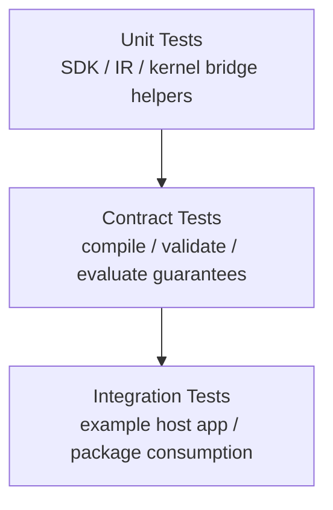

# Testing Strategy

The SDK path needs a smaller and stricter test strategy than the prototype.
Legacy tests remain useful as reference material, but they do not define truth
for the new embedded engine.

## Testing Layers

## Current Rewrite Test Coverage

- `tests/sdk/EngineTests.cpp`
  Confirms the SDK facade links, validates formulas, compiles reusable formula handles, and returns structured errors.
- `tests/sdk/TypesTests.cpp`
  Verifies stable public value, schema constant/value behavior, and policy behavior.
- `tests/frontend/LexerTests.cpp`
  Verifies tokenization, spans, and lexer diagnostics.
- `tests/frontend/ParserTests.cpp`
  Verifies precedence, grouping, nested/mixed function calls, `If`, and parse failures including malformed call syntax.
- `tests/ir/NodeTests.cpp`
  Verifies the trusted-subset IR shape and construction helpers.
- `tests/semantics/ValidatorTests.cpp`
  Verifies unknown-symbol, arity, feature-gate, structural-limit, constant-condition branch pruning, schema-valued constant reasoning, constant runtime-trap detection, branch-compatibility, and composed-type checks.
- `tests/evaluator/ArchitectureMigrationTests.cpp`
  Verifies the lowering bridge, shared kernel execution context, and kernel-side host-function behavior used by SDK evaluation.

## What Legacy Tests Still Mean

- They provide examples and edge cases worth auditing.
- They do not force compatibility with the broad prototype language.
- They should be promoted into SDK contract tests only after feature review.

## Near-Term Contract Priorities

1. Blank or malformed source must produce structured diagnostics.
2. Unsupported syntax must fail intentionally rather than degrade into symbolic fallback.
3. Schema checks for variable/function allowlists and schema-valued constants must be deterministic.
4. Obvious type errors, incompatible `If` result shapes, and constant runtime traps should fail during validation instead of waiting for runtime.
5. Compiled formulas must be reusable opaque handles rather than reparsed SDK state.
6. Engine-scoped function registration must avoid global mutable behavior.
7. Evaluation budgets must fail with structured runtime errors.
8. CLI binding parsing must stay deterministic enough for manual SDK checks.
